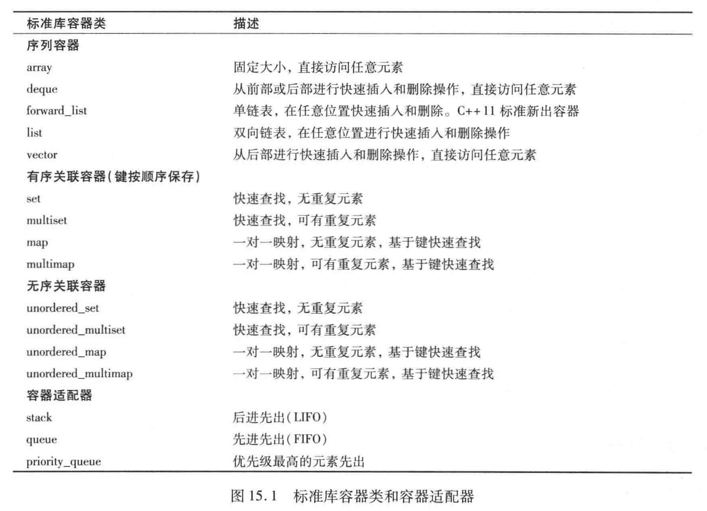
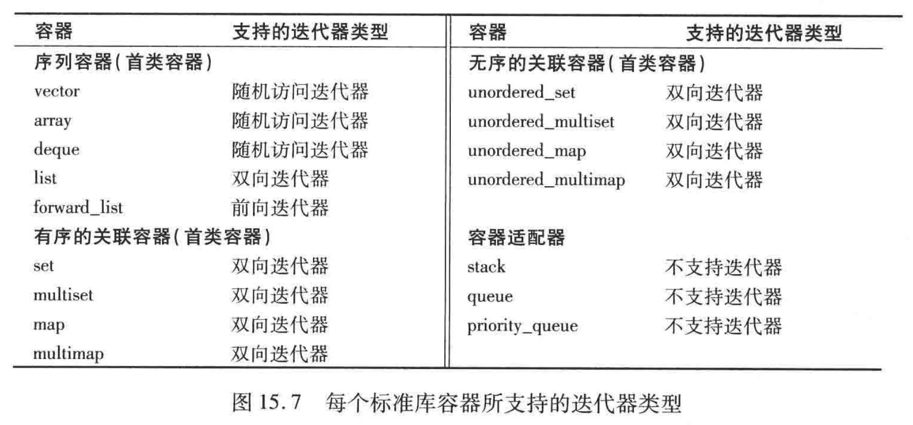
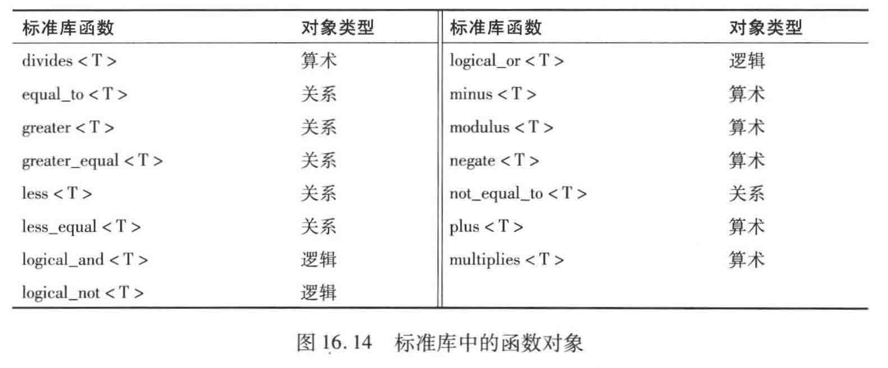

<!-- START doctoc generated TOC please keep comment here to allow auto update -->
<!-- DON'T EDIT THIS SECTION, INSTEAD RE-RUN doctoc TO UPDATE -->


- [标准模板库 STL](#%E6%A0%87%E5%87%86%E6%A8%A1%E6%9D%BF%E5%BA%93-stl)
  - [1. 容器](#1-%E5%AE%B9%E5%99%A8)
    - [1.1 容器简介](#11-%E5%AE%B9%E5%99%A8%E7%AE%80%E4%BB%8B)
    - [1.2 vector 对象是如何增长的](#12-vector-%E5%AF%B9%E8%B1%A1%E6%98%AF%E5%A6%82%E4%BD%95%E5%A2%9E%E9%95%BF%E7%9A%84)
  - [2. 迭代器](#2-%E8%BF%AD%E4%BB%A3%E5%99%A8)
    - [2.1 迭代器简介](#21-%E8%BF%AD%E4%BB%A3%E5%99%A8%E7%AE%80%E4%BB%8B)
    - [2.2 迭代器类型和迭代器类型的层次](#22-%E8%BF%AD%E4%BB%A3%E5%99%A8%E7%B1%BB%E5%9E%8B%E5%92%8C%E8%BF%AD%E4%BB%A3%E5%99%A8%E7%B1%BB%E5%9E%8B%E7%9A%84%E5%B1%82%E6%AC%A1)
  - [3. 标准库算法](#3-%E6%A0%87%E5%87%86%E5%BA%93%E7%AE%97%E6%B3%95)
    - [3.1 标准库算法介绍](#31-%E6%A0%87%E5%87%86%E5%BA%93%E7%AE%97%E6%B3%95%E4%BB%8B%E7%BB%8D)
    - [3.2 lambda 表达式](#32-lambda-%E8%A1%A8%E8%BE%BE%E5%BC%8F)
  - [4. 标准库特殊设施](#4-%E6%A0%87%E5%87%86%E5%BA%93%E7%89%B9%E6%AE%8A%E8%AE%BE%E6%96%BD)
    - [4.1 tuple 类型](#41-tuple-%E7%B1%BB%E5%9E%8B)
    - [4.2 bitset 类型](#42-bitset-%E7%B1%BB%E5%9E%8B)
    - [4.3 正则表达式](#43-%E6%AD%A3%E5%88%99%E8%A1%A8%E8%BE%BE%E5%BC%8F)
    - [4.4 随机数](#44-%E9%9A%8F%E6%9C%BA%E6%95%B0)
- [其他笔记](#%E5%85%B6%E4%BB%96%E7%AC%94%E8%AE%B0)
    - [一些常用容器和操作](#%E4%B8%80%E4%BA%9B%E5%B8%B8%E7%94%A8%E5%AE%B9%E5%99%A8%E5%92%8C%E6%93%8D%E4%BD%9C)
      - [\<vector\>常用操作](#%5Cvector%5C%E5%B8%B8%E7%94%A8%E6%93%8D%E4%BD%9C)
      - [\<unordered_map\>常用操作](#%5Cunordered_map%5C%E5%B8%B8%E7%94%A8%E6%93%8D%E4%BD%9C)
      - [\<queue> 常用操作](#%5Cqueue-%E5%B8%B8%E7%94%A8%E6%93%8D%E4%BD%9C)
      - [\<deque> 双向队列，常用操作](#%5Cdeque-%E5%8F%8C%E5%90%91%E9%98%9F%E5%88%97%E5%B8%B8%E7%94%A8%E6%93%8D%E4%BD%9C)
      - [\<set> 和 \<unordered_set>](#%5Cset-%E5%92%8C-%5Cunordered_set)
      - [\<multiset>](#%5Cmultiset)

<!-- END doctoc generated TOC please keep comment here to allow auto update -->


# 标准模板库 STL

STL由三个关键组件构成:
- 容器(container)
- 迭代器(iterator)
- 算法(algorithm)

---
## 1. 容器

### 1.1 容器简介

1. STL容器能存放几乎所有类型的数据。容器可分类为：
    - 首类容器
        - 序列容器
        - 关联容器
    - 适配器
        - 栈
        - 队列
    - 近容器
        - C类型的基于指针的数组
        - 维护标志位的bitset
        - ... (功能与首类容器类似，但不支持全部功能)

2. STL的容器类型：
    <div align="center">
    
    <br><br>
    </div>

    - 序列容器：线性的数据结构，其中的元素在概念上"排成一行"。
    - 关联容器：非线性，通常可以快速锁定其中的元素。C++11中，关联容器的键的类型是不可变的。
    - 适配器：栈和队列都是在序列容器的基础上加以约束得到的。

---
### 1.2 vector 对象是如何增长的
1. vector 和 string 类型提供了一些成员函数，允许我们与它的实现中内存分配部分互动。
    ```cpp
    c.shrink_to_fit()       // 将 capacity() 减少为 size() 相同大小
    c.capacity()            // 不重新分配内存的话，c的容量
    c.reserve(n)            // 分配至少能容纳 n 个元素的内存空间
    ```
    shrink_to_fit() 除了适用于 vector 和 string，还可用于 deque.


2. 只有当需要的内存空间超过当前容量时，reserve 调用才会改变 vector 的容量。而且 reserve 至少分配与需求容量一样大的内存空间。

3. 当需求大小小于当前容量时，reserve 也不会退回内存空间。 而同样地，resize 成员函数只改变容器中元素的数量，而不改变容量，resize 也不会减少内存空间。

4. shrink_to_fit() 可以要求这些容器退回不需要的内存空间。但是有些具体实现中，也不一定能保证退回。

---
## 2. 迭代器

### 2.1 迭代器简介
1. 迭代器在很多方面与指针类似，是用于指向首类容器中的元素(以及其他用途)。迭代器存有它们所指的特定容器的状态信息，即迭代器对每种类型的容器都有一个实现。

2. STL首类容器提供了成员函数 begin() 和 end()，begin()返回一个指向容器中 __第一个元素__ 的迭代器，end()返回一个指向容器中 __最后一个元素的下一个元素__ (用于判断是否迭代到末尾)的迭代器。 如果迭代器 i 指向一个特定的元素，那么 ++i 指向这个元素的下一个元素。 *i 是i指向的元素。

3. front() 返回容器的第一个元素的引用，而 begin() 返回一个指向第一个元素的迭代器； back() 返回容器最后一个元素的引用，而 end() 返回一个指向末尾的迭代器。

---
### 2.2 迭代器类型和迭代器类型的层次

1. 每种迭代器类型都提供了一些特定的功能。下图给出了迭代器类型的层次划分，从底部到顶部，每种迭代器都支持其下方迭代器的所有功能。即最"弱"的迭代器类型位于底部，最"强"的位于顶部。但它们之间不是类继承关系。
    <div align="center">
    <br>
    
    <br><br>
    </div>

2. 各种类型详解：
    - 随机访问迭代器：可以直接访问容器中任意元素，可向前或向后跳转任意个元素。
    - 双向迭代器：在前向迭代器基础上增加了向后移动的功能。
    - 前向迭代器：可以进行前向遍历。
    - 输入迭代器：用于将元素写入容器。每次只能向前移动一个元素。
    - 输出迭代器：用于从容器中读取元素。每次只能向前移动一个元素。

3. 容器对迭代器的支持：
    <div align="center">
    
    <br><br>
    </div>

4. array、vector、deque 的类模板都是基于数组的。而list和forward_list是基于链表的。
---

## 3. 标准库算法

### 3.1 标准库算法介绍
1. 标准库算法仅通过迭代器间接地操作容器元素。

2. 一些常用的标准库算法：
    - equal()，比较两个值的序列是否相等。
    - remove()，删除两个迭代器之间所有值为x的元素
    - replace()，将两个迭代器之间值为x的元素替换为y
    - random_shuffle()，将两个迭代器之间的元素进行随机重排序。
    - count()，统计两个迭代器之间值为x的元素
    - transform()，对两个迭代器之间的元素应用一个通用函数。
    - find()，查找两个迭代器之间值为x的元素
    - sort(),对两个迭代器之间的元素进行排列
    - binary_search()，确定值x是否在两个迭代器之间
    - swap()，交换两个元素的值
    - reverse()，反转两个迭代器之间的元素
    - ...

3. __函数对象__：任何可以接收函数指针的算法都可以接收一个类的对象，这个类使用一个称为 operator() 的函数重载函数调用运算符，只要这个重载的运算符满足算法的需要。 其实实际上在使用()符号对这个类的对象进行操作时，可以得到与调用函数指针相同的效果。 (只要重载了函数调用运算符的对象都是函数对象)。与函数指针相比，函数对象能够实现 inline 调用。函数对象是C++特有的，因为只有C++中才可以重载()运算符。 而C中只有函数指针。


    - STL内置函数对象：
    <div align="center">
    
    <br><br>
    </div>
---
### 3.2 lambda 表达式

1. __lambda 表达式__ 使程序员能够在将函数对象传递给一个函数的地方定义匿名的函数对象。lambda表达式被局部地定义在函数内，可以"捕获"它所在的函数的局部变量，然后在lambda表达式的体中操作这些变量。例子：

    ```cpp
    #include <iostream>
    #include <vector>
    #include <algorithm>

    int main(){
        using namespace std;

        vector<int> values = {1, 2, 3, 4};

        // for_each 定义在 <algorithm 中>
        for_each(values.begin(), values.end(),    
                [](int i) {cout << i << " "; });
        cout << endl;
        
        int sum = 0;
        for_each(values.begin(), values.end(),
                [&sum](int i) {sum += i; });
        
        cout << sum << endl;
        return 0;
    }

    ```
    输出：
    ```
    1 2 3 4 
    10
    ```

2. lambda 表达式以 lambda导引器(introducer)  [] 开始，然后是形参表和函数体。如果函数体是形如 "return 表达式" 的单条语句，那么返回值类型可被自动推断；否则，默认的返回类型是 void，或者可以显示地使用尾随返回值类型。编译器将这个 lambda 表达式转换成一个函数对象。  

3. 在第二个例子中， lamdba 导引器 [&sum] 表明该 lambda 表达式以按引用的方式捕获局部变量sum，因此这个 lambda 表达式可以修改 sum 的值。for_each()算法将 vector 中的每个元素传递个这个 lambda 表达式。

    尾随返回值类型，例子：
    ```cpp
    template <typename T>
    auto maximum(T x, T y, T z) -> T
    ```

4. 另外，lambda 表达式也可以赋值给变量，然后这个变量可以用来调用 lambda 表达式或将其传递给其他函数。
    ```cpp
    auto myLambda = [](int i){cout << i * 2 << " ";};

    myLambda(10);
    ```
    输出：
    ```
    20
    ```

---
# 几种标准库容器及内部实现（面试常考）


---
# 其他笔记

### 一些常用容器和操作
#### \<vector\>常用操作
1. 声明一维和二维向量
    ```cpp
    //一维
    int size = 10;
    vector<int> vec(size);
    //二维
    int row = 5, col = 10;
    vector<vector<int>> matrix(row, vector<int>(col));
    ```

2. 排序
    ```cpp
    sort(vec.begin(), vec.end(), static compare);
    ```
3. 切片
    ```cpp
    vector<int> v2 = vector<int>(v1.begin(), v1.begin()+10);
    ```
4. 获取最后一个元素
    ```cpp
    vec[vec.size()-1];  //直接返回引用
    vec.at()       //直接返回引用，跟用下标一样
    vec.back();    //返回指向最后一个元素的引用
    vec.end()-1;   //返回一个指向最后一个元素的迭代器
    vec.rbegin();  //返回反向迭代器
    ```
5. 删除最后一个元素 
    ```cpp
    vec.pop_back();
    ```

#### \<unordered_map\>常用操作
1. 遍历
    ```cpp
    for (auto iter = groups.begin(); iter != groups.end(); iter++){
            auto key = iter->first;
            auto val = iter->second;
    }
    ```

2. 添加
    ```cpp
        map.insert(std::make_pair(key, val));
    ```

3. 修改
    ```cpp
        map[key] = newVal;  //最好是在确保该key存在的情况下再做此操作
    ```

4. 查找 （使用迭代器）
    ```cpp
    std::unordered_map<int, std::string>::iterator iter;
    if ((iter = map.find(key)) != map.end()) {
        std::cout << iter->second << std::endl;
    }

    //或
    if(map.count(key) == 0)
    ```
    或者使用at()，但是如果该key不存在会抛出OOR异常

5. 删除
    ```cpp
    map.erase(key);
    ```
    不要轻易使用map[key]，因为如果该Key不存在，会被自动创建。

#### \<queue> 常用操作
1. 初始化
    ```cpp
    std::queue<int> first;            // empty queue
    std::queue<int> second (mydeck);  // queue initialized to copy of deque
    ```

2. 成员函数
    - empty()
    - size()
    - front()  访问队首元素
    - back()   访问队尾元素
    - push()
    - pop()

#### \<deque> 双向队列，常用操作

1. 成员函数
    - at() 访问元素
    - push_front()
    - pop_front()
    - push_back()
    - pop_back()
    - front()   队首元素引用
    - back()    队尾元素引用
    - size()
    - empty()

#### \<set> 和 \<unordered_set>

- 函数
    - insert()  插入
    - erase()   删除

- 区别在于set将数据有序存储，插入和查询的时间复杂度为O(logn)，一般是用红黑树实现
- 而unordered_set中数据是无序的，插入和查询时间复杂度为O(1)，跟map 和 unordered_map的关系一样，map中是按key排序的，支持运算符重载。
- 自动排序的优点是使得搜寻元素时具有良好的性能，具有对数时间复杂度。但是造成的一个缺点就是：
    - 不能直接改变元素值。因为这样会打乱原有的顺序
    - 改变元素值的方法是：先删除旧元素，再插入新元素。
    - 存取元素只能通过迭代器，从迭代器的角度看，元素值是常数。

#### \<multiset>

- set和multiset的区别是：set插入的元素不能相同，但是multiset可以相同。


1. \<cmath> 数学库
    ```cpp
    ceil(x)         // 向下取整
    floor(x)        // 向上取整
    fabs(x)         // x的绝对值
    sqrt(x)         // x的平方根
    log(x)          // 自然对数为底的对数
    log10(x)        // 10位底的对数
    ...
    ```

2. \<string\>常用操作

    1. 获取长度
        ```cpp
        str.length()
        ```

    2. 切片
        ```cpp
        str.substr(a, len);  //接受两个int，从a开始，切出共len个字符的子串
        ```

    3. string和数值类型相互转换
        ```cpp
        int num = std::stoi(str);       //string -> int
        double dnum = std::stod(str);   //string -> double
        ```
        ```cpp
        string str = std::to_string(...)  // int,double... -> string
        ```

3. 随机数   
    ```cpp
    /** Get a random element from the collection. */
    int getRandom() {
        int s = nums.size();
        int r = rand() % s;
        return nums[r];
    }
    ```

4. C++的stl中的哈希表  
    STL中，map 对应的数据结构是 红黑树。红黑树是一种近似于平衡的二叉查找树，里面的数据是有序的。在红黑树上做查找操作的时间复杂度为 O(logN)。而 unordered_map 对应 哈希表，哈希表的特点就是查找效率高，时间复杂度为常数级别 O(1)， 而额外空间复杂度则要高出许多。所以对于需要高效率查询的情况，使用 unordered_map 容器。而如果对内存大小比较敏感或者数据存储要求有序的话，则可以用 map 容器。

    ```cpp
    #include <iostream>
    #include <unordered_map>
    #include <string>
    int main(int argc, char **argv) {
        std::unordered_map<int, std::string> map;
        map.insert(std::make_pair(1, "Scala"));
        map.insert(std::make_pair(2, "Haskell"));
        map.insert(std::make_pair(3, "C++"));
        map.insert(std::make_pair(6, "Java"));
        map.insert(std::make_pair(14, "Erlang"));
        std::unordered_map<int, std::string>::iterator it;
        if ((it = map.find(6)) != map.end()) {
            std::cout << it->second << std::endl;
        }
        return 0;
    }
    ```

5. 用transform转换字符串大小写
    ```cpp
    transform(s.begin(), s.end(), s.begin(), ::tolower);
    ```

6.  ASCII 码范围
    - a-z：97-122
    - A-Z：65-90
    - 0-9：48-57

7. 排序函数 <algorithm>  
    - std::sort(vector.begin(), vector.end(), function/object)，第三个参数可以传函数指针，对象，或者什么都不传（默认的compare函数）  
    - 对数组：std::sort(a[0], a[10])

8. 堆 （优先队列） <queue>::priority_queue
    例子：找到数组中第k大的数 (leetcode 215)
    ```cpp
        priority_queue<int, vector<int>, greater<int>> store;
        //堆中维持k个最大数
        for (int i = 0; i < numsSize; i++)
        {
            store.push(nums[i]);
            if (int(store.size()) > k)
            {
                store.pop();
            }
        }

        result = store.top();
    ```
    使用greater<int> 为小顶堆，否则为大顶堆，或使用自己的比较函数

