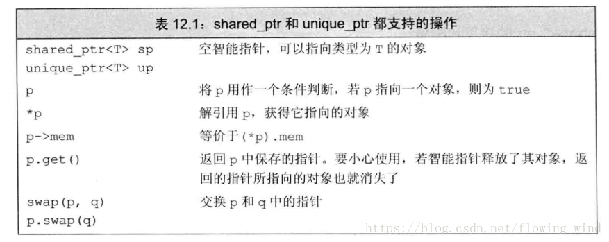
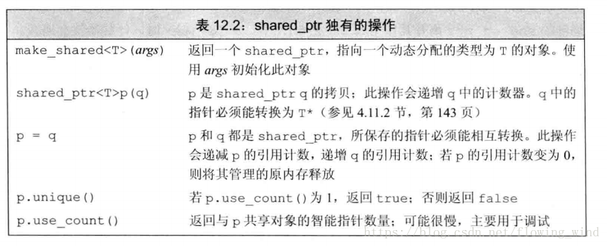

<!-- START doctoc generated TOC please keep comment here to allow auto update -->
<!-- DON'T EDIT THIS SECTION, INSTEAD RE-RUN doctoc TO UPDATE -->


- [C++ 动态内存和智能指针](#c-%E5%8A%A8%E6%80%81%E5%86%85%E5%AD%98%E5%92%8C%E6%99%BA%E8%83%BD%E6%8C%87%E9%92%88)
    - [1. shared_ptr 类](#1-shared_ptr-%E7%B1%BB)
    - [2. 直接管理内存](#2-%E7%9B%B4%E6%8E%A5%E7%AE%A1%E7%90%86%E5%86%85%E5%AD%98)
    - [3. shared_ptr 和 new 结合使用](#3-shared_ptr-%E5%92%8C-new-%E7%BB%93%E5%90%88%E4%BD%BF%E7%94%A8)
    - [4. 智能指针和异常](#4-%E6%99%BA%E8%83%BD%E6%8C%87%E9%92%88%E5%92%8C%E5%BC%82%E5%B8%B8)
    - [5. unique_ptr](#5-unique_ptr)
    - [6. weak_ptr](#6-weak_ptr)
- [C/C++内存管理](#cc%E5%86%85%E5%AD%98%E7%AE%A1%E7%90%86)
  - [1. 内存分配方式](#1-%E5%86%85%E5%AD%98%E5%88%86%E9%85%8D%E6%96%B9%E5%BC%8F)
  - [2. 控制C++的内存分配](#2-%E6%8E%A7%E5%88%B6c%E7%9A%84%E5%86%85%E5%AD%98%E5%88%86%E9%85%8D)
  - [3. 常见的内存错误和对策](#3-%E5%B8%B8%E8%A7%81%E7%9A%84%E5%86%85%E5%AD%98%E9%94%99%E8%AF%AF%E5%92%8C%E5%AF%B9%E7%AD%96)

<!-- END doctoc generated TOC please keep comment here to allow auto update -->

# C++ 动态内存和智能指针

为了更安全的使用动态对象，标准库定义了两个智能指针类型来管理动态分配的对象。当一个对象应该被释放时，指向它的智能指针可以确保自动地释放它。

智能指针的行为类似常规指针，重要的区别是它负责自动释放所指向的对象。新标准库提供的这两种智能指针的区别在于管理底层指针的方式 (以下三种类型都定义在\<memory\>头文件)：
- __shared_ptr__ 允许多个指针指向同一个对象
- __unique_ptr__ 则"独占"所指向的对象
- __weak_ptr__ 是一个伴随类，是一种弱引用

### 1. shared_ptr 类

1. 智能指针也是模板，创建一个智能指针：
    ```cpp
    shared_ptr<string> p1;          // 一个可以指向 string 的 shared_ptr
    shared_ptr<list<int>> p2;       // 一个可以指向 list<int> 的 shared_ptr

    // 使用方式与普通指针类似
    if(p1 & p1->empty())
        *p1 = "hi";
    ```

2. 下边是 shared_ptr 和 unique_ptr 都支持的操作以及 shared_ptr 独有的操作

    <div align="center">
    
    <br><br>
    </div>

    <div align="center">
    
    <br><br>
    </div>

3. __make_shared 函数__
    - 最安全的分配和使用动态内存的方式。
    - 此函数在动态内存中分配一个对象并初始化，返回指向该对象的 shared_ptr。
        ```cpp
        // p3 指向 int 类型 42
        shared_ptr<int> p3 = make_shared<int>(42);
        // p4 指向 string 类型 "9999999999"
        shared_ptr<string> p4 = make_shared<string>(10, '9');
        // p5 指向一个 int ，初值为 0
        shared_ptr<int> p5 = make_shared<int>();
        ```
    - 通常用 auto 定义一个对象来存储 make_shared 返回的结果：
        ```cpp
        auot p6 = make_shared<vector<string>>();
        ```

4. __shared_ptr 的拷贝和赋值__
    - 当进行拷贝或赋值操作时，每个 shared_ptr 都会记录有多少个其他 shared_ptr 指向相同的对象，详见上面表中对赋值操作的解释。
    - 每个 shared_ptr 都有一个引用计数，当拷贝一个 shared_ptr，用一个 shared_ptr 初始化另一个，或将其传递给函数、其作为函数返回值时，引用计数加一；当给一个 shared_ptr 赋新值(改变指针指向)、或 shared_ptr 被销毁时，引用计数会减一。  
    当引用计数为0时，就会自动释放自己所管理的对象。
        ```cpp
        auto r = make_shared<int>(42);
        r = q;
        // 给 r 赋值，这样 r 的指向被改变，r原来所指的对象的引用计数会减一，q 指向对象的引用计数加一。 这时 r 所指的对象引用计数为 0，会自动释放。
        ```

5. 当引用计数为0， shared_ptr 销毁其指向的对象时，会调用该对象的析构函数来销毁。

6. 对于一块内存，shared_ptr 类保证只要有任何 shared_ptr 对象引用它，它就不会被释放掉。

7. 使用动态内存的一个常见原因是允许多个对象共享相同的状态。


---
### 2. 直接管理内存

1. 直接管理内存是指用 __new__ 分配内存，用 __delete__ 释放内存。相比于智能指针，手动管理内存很容易出错，而且不能依赖类对象拷贝、赋值和销毁操作的任何默认定义。

2. new 操作在堆中申请一块内存构造对象，并返回指向该对象的指针。对于内置类型需要手动初始化，对自定义类型使用构造函数初始化。

3. 当内存耗尽时，new 操作符会抛出 bad_alloc 异常。但可以通过 __定位new__ 来避免:
    ```cpp
    int *p1 = new (nothrow) int;     // 分配失败，new 操作符会返回一个空指针
    ```

4. __delete__ 接受一个指针，这个指针所指向的内存必须是用 new 分配的、或者指向nullptr。delete执行两个动作：销毁给定指针所指向的对象；释放对应内存。

5. 对于一个由内置指针管理的动态对象(new 分配的)，直到被显示释放前它都是存在的。而且如果函数将一个指向由 new 分配内存的指针给其调用者，相当于给其调用者增加了负担，因为调用者需要记得释放内存。

6. 使用 new 和 delete 管理动态内存的三个常见问题：
    - 忘记 delete 内存
    - 使用已经释放掉的对象
    - 同一块内存释放两次

    坚持使用智能指针，可以避免所有这些问题。


---
### 3. shared_ptr 和 new 结合使用

1. 可以用 new 返回的指针来初始化智能指针：
    ```cpp
    shared_ptr<int> p1(new int(42));     // p2 指向一个值为 42 的 int

    shared_ptr<int> p1 = new int(42);    // 这样用是错误的，智能指针不支持隐式转换
    ```

    当将一个 shared_ptr 绑定到一个普通指针时，我们就将内存管理的责任交给了这个 shared_ptr。一旦这样做了，我们就不应该再使用内置指针来访问 shared_ptr 所指向的内存了。

2. 调用 shared_ptr 类对象的 get() 函数可以返回对象中的指针，但永远不要用 get() 返回的指针初始化另一个智能指针或者为另一个智能指针赋值。

3. shared_ptr 还支持 reset() 操作，将一个新的指针赋予一个 shared_ptr，reset()会更新引用计数。 reset() 经常与 unique() 函数一起使用，来控制多个 shared_ptr 共享的对象：
    ```cpp
    p = new int(1024);      // 这样是错误的，不能将普通指针直接赋值给智能指针
    p.reset(new int(1024)); // 这样是正确的，p指向一个新对象，原引用计数减一
    ```

    ```cpp
    if(!p.unique()){
        p.reset(new string(*p));    // 我们不是唯一用户，分配新的拷贝
    }
    *p += newVal;           // 现在我们知道我们是唯一的用户，可以对对象进行修改了
    ```
---
### 4. 智能指针和异常

1. 当使用智能指针时，即使程序块过早结束，智能指针也能确保在内存不需要时将其释放。但是对于 new 分配的内存(直接管理的内存)，在 new 之后，delete 之前发生了异常，该内存不会被释放。

2. __自定义删除器__
    - 对于 struct 定义的类(无析构函数)，可以自定义一个删除器函数传给 shared_ptr，从而使 shared_ptr 能够对其指针进行正确释放。
        ```cpp
        struct connection;
        struct destination;
        connection connect(destination *);
        void disconnect(connection);

        void end_connection(connection *p){     // 自定义删除器
            disconnect(*p);
        }

        // 在使用时：
        connection c = connect(&d);         // 建立连接
        shared_ptr<connection> p(&c, end_connection);
        // 使用c 。。。 balabala
        // 即使这段代码块(函数)由于异常而中断，c 也会被正确关闭。
        ```

        当 p 被销毁时，不会对其保存的指针调用 delete,而是 end_connection。

3. 几个智能指针陷阱，需要注意：
    - 不使用相同的内置指针初始化多个智能指针。 因为一个智能指针所指的内存被释放，会使其他的几个空悬。
    - 不 delete 由 get() 函数返回的指针。
    - 不使用 get() 初始化或 reset() 另一个智能指针。
    - 如果使用 get() 返回的指针，当最后一个对应的智能指针销毁后，你的指针就变为无效了。
    - 如果使用智能指针管理的资源不是 new 分配的内存，记住传递给它一个删除器。

---
### 5. unique_ptr

1. 一个 unique_ptr “拥有” 它所指向的对象。某个时刻只能有一个 unique_ptr 指向一个给定对象。 当 unique_ptr 被销毁时，它所指向的对象也被销毁。

2. 当使用 unique_ptr 时，必须将其绑定到一个 new 返回的指针上。
    ```cpp
    unique_ptr<double> p1;
    unique_ptr<int>(new int(42));
    ```

3. unique_ptr 不支持一般的拷贝和赋值操作，但是可以使用 u.release() 或 u.reset() 函数将指针的所有权从一个 unique_ptr 转移给另一个：
    ```cpp
    // release将p1置为空，并把所有权转移给p2
    unique_ptr<string> p2(p1.release());    

    // 将所有权从p3转移给p2
    unique_ptr<string> p3(new string("trex"));
    p2.reset(p3.release());     // reset 释放了p2的内存，并将p3转移给p2;
    ```

4. 允许拷贝或赋值一个将要被销毁的 unique_ptr 对象。例如从函数返回一个 unique_ptr 对象。

5. 与 shared_ptr 不同，重载 unique_ptr 的删除器时，需要在创建或reset时显示指明删除器的类型：
    ```cpp
    unique_ptr<objT, delT> p (new objT, fcn);

    // 将上面 connection 的例子改为 unique_ptr：

    connection c = connect(&d);
    unique_ptr<connection, decltype(end_connection)*> p(&c, end_connection);

    // 这里 end_connection 是一个函数，decltype()返回一个函数类型，*表示函数指针
    ```


### 6. weak_ptr

1. __weak_ptr 是一种不控制所指向对象生存期的指针，它指向一个由 shared_ptr 管理的对象__。 将一个 weak_ptr 绑定到一个 shared_ptr 不会改变 shared_ptr 的引用计数。一旦最后一个指向对象的 shared_ptr 被释放，对象就会被释放掉，即使有 weak_ptr 指向该对象，也还是会被释放。 因此说它是 “弱” 共享对象。

2. 当创建一个 weak_ptr 对象时，要用一个 shared_ptr 来初始化：
    ```cpp
    shared_ptr<int> p = make_shared<int>(42);
    weak_ptr<int> wp(p);        // 弱共享p; 此时p的引用计数不变
    ```

3. weak_ptr 使用函数 w.expired() 查看是否过期； 还可以通过 w.use_count() 查看共享的 shared_ptr 的引用计数。

4. 因为 weak_ptr 共享的对象可能不存在，所以不能直接使用 weak_ptr 来访问对象，而必须调用 w.lock()。如果对象存在，该函数返回一个指向对象的 shared_ptr，否则返回一个空的 shared_ptr.
    ```cpp
    //在语句块中使用np访问对象，语句块结束np销毁
    if(shared<int> np = wp.lock();){        
        ...
    }
    ```


---
# C/C++内存管理

## 1. 内存分配方式

1. C++中，内存分成5个区
    - __栈__  
        - 函数内局部变量的存储单元都可以在栈上创建，函数执行结束时这些存储单元自动被释放。占内存分配运算内置于存储期指令集中，效率高，但内存容量有限。
    - __堆__
        - 就是由 new 分配的内存块，由程序控制它们的释放。如果程序员没有手动释放，则要到程序结束后由操作系统自动回收。
    - __自由存储区__
        - 由 malloc 等分配的内存块，和堆十分相似，不过是用 free 来回收释放的。
    - __全局/静态存储区__
        - 全局变量和静态变量被分配到同一块内存中，共同占用同一块内存区。
    - __常量存储区__
        - 存放常量，不允许修改。


<div align="center">
<br>

<br><br>
</div>


2. 堆和栈的区分
    - 例子：
    ```cpp
    void f(){
        int *p = new int[5];
    }
    ```
    看到 new，就应该想到分配了一段堆内存，而指针 p 是存在于栈内存中的，因为它是函数中的局部变量。即：在栈内存中存放了一个指向一块堆内存的指针 p。 

    - 具体区别：
        - __管理方式不同__：栈由编译器自动管理，无需手动控制；但是堆内存释放需要由程序员控制，很容易导致内存泄漏。
        - __空间大小不同__：堆内存一般没什么限制，32位系统中可以达到4G，其实就是操作系统可寻址的内存空间。但栈内存只有几M。 但是对于堆而言，频繁使用 new/delete 会导致内存空间不连续，从而导致大量内存碎片(但是现在基本也不用考虑这种问题了，用内存碎片填满一整个服务器的内存要好久，而在这期间服务器早就因为维护而重启了)。
        - __生长方向不同__：堆是向上生长的，也就是向着内存地址增加的方向；而栈是向下生长的，向着内存地址减小的方向生长。
        - __分配方式不同__： 堆都是动态分配的；栈既可以动态分配又可以静态分配。静态分配(如局部变量的分配)是由编译器在编一阶段完成的。动态分配由 alloca 函数进行分配，但是栈动态分配的内存的释放也是由编译器完成的，不需要手动操作。
        - __分配效率不同__：栈的操作效率比堆要高。

    - 栈在程序中的应用是最广泛的，但是跟堆相比不够灵活。有时候需要分配大量内存空间，还是使用堆更好一些。

--- 
## 2. 控制C++的内存分配

1. __new 和 malloc 的区别__
    - __申请内存的所在位置__
        - new 操作符从 自由存储区 上为对象动态分配内存空间。
        - malloc 函数从 堆 上动态分配内存。自由存储区既可以是堆，也可以是静态存储区，这都看 operator new 在哪里为对象分配内存。
    
    - __返回类型的安全性__
        - new 分配内存成功时，返回的是对象类型的指针，类型严格与对象匹配，无需进行转换，所以 new 是类型安全的操作符。
        - malloc 当分配成功时返回 void* 需要通过强制类型转换为需要类型。
        - 类型安全几乎可以等价于内存安全，即不会试图访问没被授权的内存区域。

    - __内存分配失败时的返回值__
        - new 内存分配失败时会抛出 bad_alloc 异常(除非限制 nothrow)。
        - malloc 分配失败时会返回 NULL 指针。

    - __是否调用构造函数/析构函数__
        - 使用 new 来分配内存时，先分配一块足够大的内存；然后编译器运行相应的构造函数以构造对象，并传入初值；构造完成后返回指向该对象的指针。
        - 使用 delete 来释放对象内存时，会先调用对象的析构函数，然后释放内存空间。
        - malloc 不会调用对象的构造函数/析构函数。所以用 malloc/free 来处理自定义类型和所有需要构造/析构的类型的对象都是不合适的。
    
    - __调用关系__： new 和 delete 操作符的实现可以基于 malloc。

    - __重载__： new 和 delete 操作符允许重载，而 malloc/free不允许函数重载。

1. 当需要使用 new 和 delete 时，需要控制C++中的内存分配。一个防止堆破碎的方法是从不同固定大小的内存池中分配不同类型的对象，对每个类重载 new 和 delete 操作符。 new 和 delete 不是标准库函数，而是操作符。

2. 重载全局的 new 和 delete 操作符
    - 例子：
        ```cpp
        void* operator new(size_t size){
            void*p = malloc(size);
            return (p);
        }

        void operator delete(void *p){
            free(p);
        }
        ```
        在C++中也可以直接调用 malloc() 和 free();
    
    - 通过重载 new 和 delete 操作符，可以自由地采用不同的分配策略，从不同的内存池中分配不同的对象。
    - 对单个的类也要重载 new[] 和 delete[] 操作符。因为它们和 new 、delete 是不同的操作符。实际上，应该避免分配对象数组，从而使内存分配策略更为简单。

---
## 3. 常见的内存错误和对策

1. __内存分配未成功就被使用__。

2. __内存分配成功，但未初始化就使用__。

3. __内存分配成功，但操作越过了边界__，如数组越界，或者在 malloc 分配内存时算错了 size。

4. __忘记释放内存导致内存泄漏__。

5. __释放了内存，却继续使用__。
    - 程序中对象调用关系过于复杂，不知道哪个对象或指针已经释放了那块内存。
    - 函数返回了指向栈内存的指针或引用，因为在函数结束时对应内存已经被系统自动释放掉了。
    - 使用 free 或 delete 释放内存后没有将指针设为 NULL 或 nullptr。即“野指针”（指向辣鸡内存的指针）。

---


