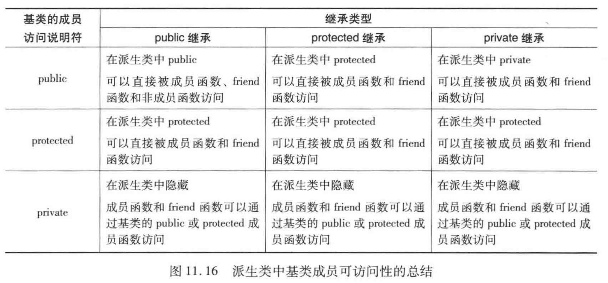
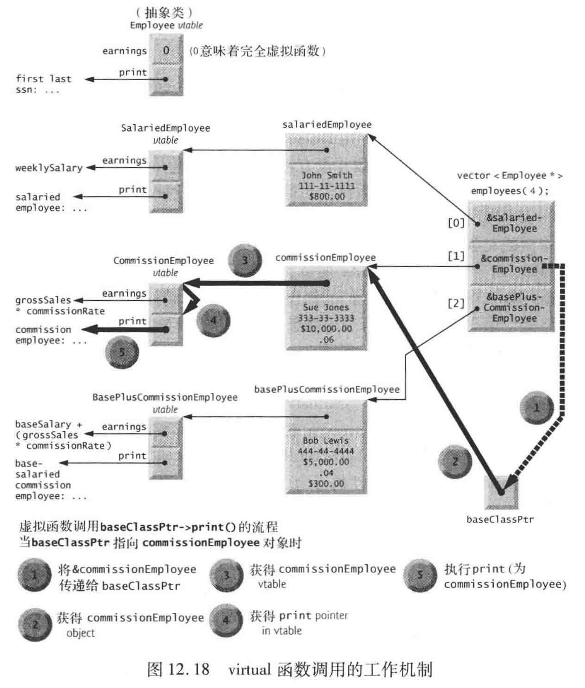
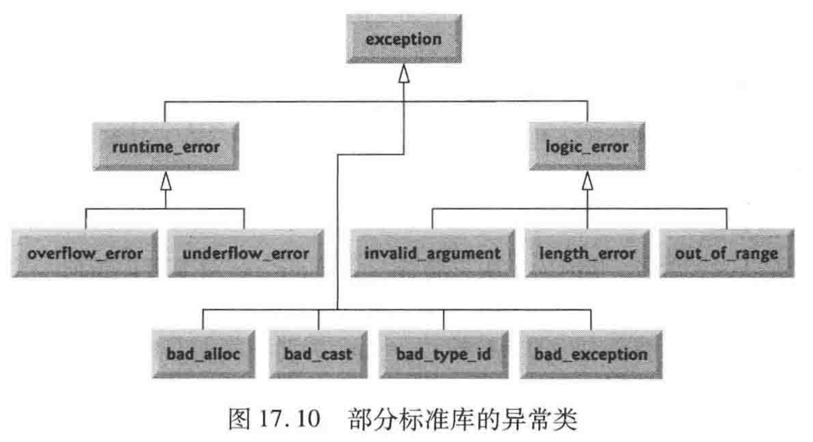

<!-- START doctoc generated TOC please keep comment here to allow auto update -->
<!-- DON'T EDIT THIS SECTION, INSTEAD RE-RUN doctoc TO UPDATE -->


- [C++初步](#c%E5%88%9D%E6%AD%A5)
  - [1. 类的例子、对象、字符串](#1-%E7%B1%BB%E7%9A%84%E4%BE%8B%E5%AD%90%E5%AF%B9%E8%B1%A1%E5%AD%97%E7%AC%A6%E4%B8%B2)
  - [2. 函数](#2-%E5%87%BD%E6%95%B0)
    - [2.1 函数原型和实参类型的强制转换](#21-%E5%87%BD%E6%95%B0%E5%8E%9F%E5%9E%8B%E5%92%8C%E5%AE%9E%E5%8F%82%E7%B1%BB%E5%9E%8B%E7%9A%84%E5%BC%BA%E5%88%B6%E8%BD%AC%E6%8D%A2)
    - [2.2 存储类别和存储期](#22-%E5%AD%98%E5%82%A8%E7%B1%BB%E5%88%AB%E5%92%8C%E5%AD%98%E5%82%A8%E6%9C%9F)
    - [2.3 作用域规则](#23-%E4%BD%9C%E7%94%A8%E5%9F%9F%E8%A7%84%E5%88%99)
    - [2.4 内联函数](#24-%E5%86%85%E8%81%94%E5%87%BD%E6%95%B0)
    - [2.5 引用和引用形参](#25-%E5%BC%95%E7%94%A8%E5%92%8C%E5%BC%95%E7%94%A8%E5%BD%A2%E5%8F%82)
    - [2.6 默认实参](#26-%E9%BB%98%E8%AE%A4%E5%AE%9E%E5%8F%82)
    - [2.7 函数重载](#27-%E5%87%BD%E6%95%B0%E9%87%8D%E8%BD%BD)
    - [2.8 函数模板](#28-%E5%87%BD%E6%95%B0%E6%A8%A1%E6%9D%BF)
  - [3. 类模板array和vector](#3-%E7%B1%BB%E6%A8%A1%E6%9D%BFarray%E5%92%8Cvector)
    - [3.1 array对象例子](#31-array%E5%AF%B9%E8%B1%A1%E4%BE%8B%E5%AD%90)
    - [3.2 C++11 基于范围的for语句](#32-c11-%E5%9F%BA%E4%BA%8E%E8%8C%83%E5%9B%B4%E7%9A%84for%E8%AF%AD%E5%8F%A5)
    - [3.3 vector](#33-vector)
  - [4. 指针](#4-%E6%8C%87%E9%92%88)
    - [4.1 使用指针的按引用传递](#41-%E4%BD%BF%E7%94%A8%E6%8C%87%E9%92%88%E7%9A%84%E6%8C%89%E5%BC%95%E7%94%A8%E4%BC%A0%E9%80%92)
    - [4.2 内置数组和指针](#42-%E5%86%85%E7%BD%AE%E6%95%B0%E7%BB%84%E5%92%8C%E6%8C%87%E9%92%88)
    - [4.3 sizeof 运算符](#43-sizeof-%E8%BF%90%E7%AE%97%E7%AC%A6)
    - [4.4 指针表达式和算术运算](#44-%E6%8C%87%E9%92%88%E8%A1%A8%E8%BE%BE%E5%BC%8F%E5%92%8C%E7%AE%97%E6%9C%AF%E8%BF%90%E7%AE%97)
    - [4.5 基于指针的字符串(C风格)](#45-%E5%9F%BA%E4%BA%8E%E6%8C%87%E9%92%88%E7%9A%84%E5%AD%97%E7%AC%A6%E4%B8%B2c%E9%A3%8E%E6%A0%BC)
    - [其他](#%E5%85%B6%E4%BB%96)
- [面向对象编程](#%E9%9D%A2%E5%90%91%E5%AF%B9%E8%B1%A1%E7%BC%96%E7%A8%8B)
  - [5. 类](#5-%E7%B1%BB)
    - [5.1 实例研究](#51-%E5%AE%9E%E4%BE%8B%E7%A0%94%E7%A9%B6)
    - [5.2 C++11 委托构造函数](#52-c11-%E5%A7%94%E6%89%98%E6%9E%84%E9%80%A0%E5%87%BD%E6%95%B0)
    - [5.3 析构函数](#53-%E6%9E%90%E6%9E%84%E5%87%BD%E6%95%B0)
    - [5.4 不同作用域下构造函数和析构函数的调用时机](#54-%E4%B8%8D%E5%90%8C%E4%BD%9C%E7%94%A8%E5%9F%9F%E4%B8%8B%E6%9E%84%E9%80%A0%E5%87%BD%E6%95%B0%E5%92%8C%E6%9E%90%E6%9E%84%E5%87%BD%E6%95%B0%E7%9A%84%E8%B0%83%E7%94%A8%E6%97%B6%E6%9C%BA)
    - [5.5 const对象和const成员函数](#55-const%E5%AF%B9%E8%B1%A1%E5%92%8Cconst%E6%88%90%E5%91%98%E5%87%BD%E6%95%B0)
    - [5.6 组成：对象作为类的成员](#56-%E7%BB%84%E6%88%90%E5%AF%B9%E8%B1%A1%E4%BD%9C%E4%B8%BA%E7%B1%BB%E7%9A%84%E6%88%90%E5%91%98)
    - [5.7 友元函数和友元类](#57-%E5%8F%8B%E5%85%83%E5%87%BD%E6%95%B0%E5%92%8C%E5%8F%8B%E5%85%83%E7%B1%BB)
    - [5.8 this指针](#58-this%E6%8C%87%E9%92%88)
    - [5.9 静态数据成员](#59-%E9%9D%99%E6%80%81%E6%95%B0%E6%8D%AE%E6%88%90%E5%91%98)
  - [6. 运算符重载和动态内存分配](#6-%E8%BF%90%E7%AE%97%E7%AC%A6%E9%87%8D%E8%BD%BD%E5%92%8C%E5%8A%A8%E6%80%81%E5%86%85%E5%AD%98%E5%88%86%E9%85%8D)
    - [6.1 运算符重载基础](#61-%E8%BF%90%E7%AE%97%E7%AC%A6%E9%87%8D%E8%BD%BD%E5%9F%BA%E7%A1%80)
    - [6.2 重载二元运算符](#62-%E9%87%8D%E8%BD%BD%E4%BA%8C%E5%85%83%E8%BF%90%E7%AE%97%E7%AC%A6)
    - [6.3 重载二元流运算符](#63-%E9%87%8D%E8%BD%BD%E4%BA%8C%E5%85%83%E6%B5%81%E8%BF%90%E7%AE%97%E7%AC%A6)
    - [6.4 重载一元运算符](#64-%E9%87%8D%E8%BD%BD%E4%B8%80%E5%85%83%E8%BF%90%E7%AE%97%E7%AC%A6)
    - [6.5 动态内存管理](#65-%E5%8A%A8%E6%80%81%E5%86%85%E5%AD%98%E7%AE%A1%E7%90%86)
    - [6.6 类型转换](#66-%E7%B1%BB%E5%9E%8B%E8%BD%AC%E6%8D%A2)
    - [6.7 explicit 构造函数与转换运算符](#67-explicit-%E6%9E%84%E9%80%A0%E5%87%BD%E6%95%B0%E4%B8%8E%E8%BD%AC%E6%8D%A2%E8%BF%90%E7%AE%97%E7%AC%A6)
    - [6.8 其他](#68-%E5%85%B6%E4%BB%96)
  - [7. 面向对象：继承](#7-%E9%9D%A2%E5%90%91%E5%AF%B9%E8%B1%A1%E7%BB%A7%E6%89%BF)
    - [7.1 基本知识](#71-%E5%9F%BA%E6%9C%AC%E7%9F%A5%E8%AF%86)
    - [7.2 基类和派生类间的关系](#72-%E5%9F%BA%E7%B1%BB%E5%92%8C%E6%B4%BE%E7%94%9F%E7%B1%BB%E9%97%B4%E7%9A%84%E5%85%B3%E7%B3%BB)
    - [7.3 使用protected和private数据的继承层次](#73-%E4%BD%BF%E7%94%A8protected%E5%92%8Cprivate%E6%95%B0%E6%8D%AE%E7%9A%84%E7%BB%A7%E6%89%BF%E5%B1%82%E6%AC%A1)
    - [7.4 派生类中的构造函数和析构函数](#74-%E6%B4%BE%E7%94%9F%E7%B1%BB%E4%B8%AD%E7%9A%84%E6%9E%84%E9%80%A0%E5%87%BD%E6%95%B0%E5%92%8C%E6%9E%90%E6%9E%84%E5%87%BD%E6%95%B0)
    - [7.5 public、protected 和 private 继承](#75-publicprotected-%E5%92%8C-private-%E7%BB%A7%E6%89%BF)
  - [8. 面向对象：多态性](#8-%E9%9D%A2%E5%90%91%E5%AF%B9%E8%B1%A1%E5%A4%9A%E6%80%81%E6%80%A7)
    - [8.1 基本知识](#81-%E5%9F%BA%E6%9C%AC%E7%9F%A5%E8%AF%86)
    - [8.2 类继承层次中对象之间的关系](#82-%E7%B1%BB%E7%BB%A7%E6%89%BF%E5%B1%82%E6%AC%A1%E4%B8%AD%E5%AF%B9%E8%B1%A1%E4%B9%8B%E9%97%B4%E7%9A%84%E5%85%B3%E7%B3%BB)
    - [8.3 虚函数和虚析构函数](#83-%E8%99%9A%E5%87%BD%E6%95%B0%E5%92%8C%E8%99%9A%E6%9E%90%E6%9E%84%E5%87%BD%E6%95%B0)
    - [8.4 抽象类和纯虚函数](#84-%E6%8A%BD%E8%B1%A1%E7%B1%BB%E5%92%8C%E7%BA%AF%E8%99%9A%E5%87%BD%E6%95%B0)
    - [8.5 \*\*多态性、虚函数和动态绑定的底层实现机制](#85-%5C%5C%E5%A4%9A%E6%80%81%E6%80%A7%E8%99%9A%E5%87%BD%E6%95%B0%E5%92%8C%E5%8A%A8%E6%80%81%E7%BB%91%E5%AE%9A%E7%9A%84%E5%BA%95%E5%B1%82%E5%AE%9E%E7%8E%B0%E6%9C%BA%E5%88%B6)
    - [8.6 dynamic_cast 和 typeid](#86-dynamic_cast-%E5%92%8C-typeid)
  - [9. 异常处理](#9-%E5%BC%82%E5%B8%B8%E5%A4%84%E7%90%86)
    - [9.1 实例研究](#91-%E5%AE%9E%E4%BE%8B%E7%A0%94%E7%A9%B6)
    - [9.2 STL中的异常类层次结构](#92-stl%E4%B8%AD%E7%9A%84%E5%BC%82%E5%B8%B8%E7%B1%BB%E5%B1%82%E6%AC%A1%E7%BB%93%E6%9E%84)
- [流和文件](#%E6%B5%81%E5%92%8C%E6%96%87%E4%BB%B6)
  - [10. 输入/输出流](#10-%E8%BE%93%E5%85%A5%E8%BE%93%E5%87%BA%E6%B5%81)
  - [11. 文件](#11-%E6%96%87%E4%BB%B6)
- [模板和泛型编程](#%E6%A8%A1%E6%9D%BF%E5%92%8C%E6%B3%9B%E5%9E%8B%E7%BC%96%E7%A8%8B)
  - [12. 自定义模板介绍](#12-%E8%87%AA%E5%AE%9A%E4%B9%89%E6%A8%A1%E6%9D%BF%E4%BB%8B%E7%BB%8D)
  - [13. 自定义的模板化数据结构](#13-%E8%87%AA%E5%AE%9A%E4%B9%89%E7%9A%84%E6%A8%A1%E6%9D%BF%E5%8C%96%E6%95%B0%E6%8D%AE%E7%BB%93%E6%9E%84)
- [其他主题](#%E5%85%B6%E4%BB%96%E4%B8%BB%E9%A2%98)
  - [14. C结构体](#14-c%E7%BB%93%E6%9E%84%E4%BD%93)
    - [14.1 结构体中的运算符重载](#141-%E7%BB%93%E6%9E%84%E4%BD%93%E4%B8%AD%E7%9A%84%E8%BF%90%E7%AE%97%E7%AC%A6%E9%87%8D%E8%BD%BD)
  - [15. C++11新特性](#15-c11%E6%96%B0%E7%89%B9%E6%80%A7)
  - [16. 其他知识点](#16-%E5%85%B6%E4%BB%96%E7%9F%A5%E8%AF%86%E7%82%B9)

<!-- END doctoc generated TOC please keep comment here to allow auto update -->

# C++初步

## 1. 类的例子、对象、字符串  

1. 创建一个GradeBook类(一个成员函数)并打印信息

    ```cpp
    #include <iostream>
    #include <string>
    using namespace std;

    class GradeBook{
    public:
        explicit GradeBook(string name)
            : courseName(name){
        }
        
        void setCourseName(string name){
            courseName = name;
        }
        
        string getCourseName() const{
            return courseName;
        }
        
        void displayMessage() const{
            cout << "Welcome to the grade book of "
            << getCourseName() << endl;
        }
    private:
        string courseName;
    };

    int main(int argc, const char * argv[]) {
        string courseName;
        cout << "Please enter the course name: " << endl;
        getline(cin, courseName);  // read name with blanks;
        cout << endl;
        
        GradeBook myGradeBook(courseName);
        myGradeBook.displayMessage();
        
        return 0;
    }

    ```

-  "endl" 和 "\n"  

    - std::cout << std::endl; 插入换行符并flush the burrer
    - std::cout << "\n; 只是插入换行符

-  __成员函数声明为const__，告诉编译器这个函数不能修改调用它的对象，只有类的成员函数能这么用。

- __explicit关键字__：用来修饰构造函数，被修饰的类不能发生隐式类型转换，只能做显式类型转换。

2. 头文件中不应包含using声明，要使用std::， 但是cpp文件中可以

---

## 2. 函数
### 2.1 函数原型和实参类型的强制转换  

1. __函数原型(也成为函数声明)__ 告诉编译器函数的名称、函数返回数据的类型、函数预期接收的形参个数以及形参的类型和顺序。
    - 除非函数定义在其使用之前，否则要先声明函数原型。
    - 如果函数在调用前就已经定义，那么函数的定义也可作为函数原型，当然，好的编程习惯是总提供函数原型。
2. __函数签名__：  
    函数声明中的函数名和实参类型称为函数签名（不包含返回类型）。如果两个函数函数名相同，参数类型、参数个数都相同，只有返回类型不同，会被拒绝重载。 函数签名的例子:
    ```cpp
    maximum(int, int, int);
    ```

3. __实参类型强制转换__:  
    函数声明的一个重要特性是“实参类型强制转换“。例如：程序调用一个函数时可以使用整型实参，即使该函数原型指定的是double数据类型的形参，函数也还是会正常执行。
    ```cpp
    // 函数声明为：
    int maximum(double a, double b, double c);

    // 函数调用时, 其中 a, b, c 都为int类型
    int m = maximum(a, b, c);
    ```

4. __实参类型升级规则和隐式类型转换__:  
    实参的隐式类型转换发生时，int可以升级为double，double也可转换为int(但是会被截取)。在发生隐式类型转换时，如果把高级基本数据类型转换为低级，会产生不确定的值。

---

### 2.2 存储类别和存储期
1. 程序中标识符包括变量名和函数名等。实际上，每个标识符还有其他属性，包括 __存储类别、作用域、和链接(linkage)__ .
    - __存储类别:__ 共有5个存储类别说明符: auto、register、extern、 mutable、和static，它们决定了变量的存储期。  
    - __标识符的作用域__ 是指标识符在程序中可被引用的范围。
    - __标识符的链接__ 决定了标识符是只在声明它的源文件中可以识别，还是在经编译后链接在一起的多个文件中可以识别。
    - __标识符的存储期__ 决定了标识符在内存中存在的时间。按存储类别说明符可以划分出四个存储期：
        - 自动存储期
        - 静态存储期
        - 动态存储期
        - 线程存储期

2. 具有 __自动存储期__ 的变量包括：
    - 函数中的局部变量
    - 函数的形参
    - 用register声明的局部变量或函数形参，用 __register__ 声明的变量建议将该变量放入计算机的一个存储器中，register现在通常没有必要，现在的很多编译器可以自动识别经常使用的变量，并放到CPU存储器中。    
    
    (自动存储是节省内存的一个方法，也是最小特权原则的一个例子。)

3. __静态存储期__：
    - 关键字 __extern__ 和 __static__ 用于声明具有静态存储期的变量或函数。具有静态存储期的变量从程序开始执行一直到程序结束都一直存在于内存中，在程序执行遇到这样的变量声明时，便会对其进行一次性的初始化。
    - __extern__:  extern关键字实际上有两种用法，一种是用于声明全局变量或全局函数，例如：
        ```cpp
        extern int a;
        ```
        另外还有一种使用:
        ```cpp
        extern "C"{

            ...
        }
        ```
        用于告诉编译器这部分代码用C语言的方式进行编译和链接，目的是为了实现C++和C及其他语言的混合编程。
    
    - __static__: 用于声明静态局部变量。static声明的局部变量仅被其声明所在的函数所知。但是static局部变量在函数返回后仍保留原来的值。而且static在未显示初始化时会自动初始化为0. 类中的静态成员变量被该类所有对象所共享，也成为 __类变量__  

    
---
### 2.3 作用域规则
1. 作用域是对于标识符而言的，对程序中的标识符，程序中可使用该标识符的范围成为该标识符的作用域。作用域包括
    - 语句块作用域
    - 函数作用域
    - 全局命名空间作用域
    - 函数原型作用域

2. 一元作用域分辨运算符 (::)
    ```cpp
    #include <iostream>
    using namespace std;

    int number = 7;

    int main(int argc, const char * argv[]) {
        double number = 10.5;
        
        cout << "local variable: " << number << endl;
        cout << "global variable: " << ::number << endl;
        
        return 0;
    }
    ```
    输出：
    ```cpp
    local variable: 10.5
    global variable: 7
    ```
    总是使用一元作用域分辨运算符来引用全局变量更为清晰。

---
### 2.4 内联函数
1. __内联函数(inline function)__:  
    如果一个函数是内联的，那么在编译时，编译器会把该函数的代码副本放置在每个调用该函数的地方。对内联函数进行任何修改，都需要重新编译函数的所有客户端，因为编译器需要重新更换一次所有的代码，否则将会继续使用旧的函数。如果想把一个函数定义为内联函数，则需要在函数名前面放置关键字 inline，在调用函数之前需要对函数进行定义。如果已定义的函数多于一行，编译器会忽略 inline 限定符。

---
### 2.5 引用和引用形参

1. __按值传递和按引用传递__ (pass by value, pass by reference):   
    - 按值传递：  
        ```cpp
        int x = 3;
        int result;
        result = squareByValue(x);

        int squareByValue(int number){
            return number * number;
        }
        ```
    - 按引用传递：
        ```cpp
        int x = 3;
        squareByReference(x);

        void squareByReference(int &numberRef){
            numberRef *= numberRef;
        }
        ```
        按引用传递性能较高，可以消除按值传递复制数据所产生的开销；  
        但是按引用传递会削弱安全性。  
        有时候，为了传递大型对象，要避免复制开销，但是又要保证安全性，可以使用const施加限定。

2. 函数内引用作为别名：  
    ```cpp
    int count = 1;
    int &cRef = count;
    cRef++;
    ```
    如果cRef被更改，则count也会被修改。这里&符号是作为引用的意思，不是取地址的意思。

3. 从函数中返回引用会导致 __虚悬引用__ 问题(Dangling reference)，因为该引用对应的变量在函数执行结束时已经被销毁。

---
### 2.6 默认实参

1. 当程序在函数调用中对具有默认实参的形参省略了其对应的实参时，编译器会自动重写这个函数并插入默认的实参值。

2. 使用默认实参的例子:

    ```cpp
    int boxVolume(int length = 1, int width = 1, int height = 1);

    int main(){
        cout << boxVolume() << endl;
        return 0;
    }

    // 在函数定义部分就没必要再写一遍默认实参了
    int boxVolume(int length, int width, int height){
        return length * width * height;
    }
    ```

---
### 2.7 函数重载  
1. C++允许定义多个具有相同名字的函数，只要这些函数具有不同的函数签名（名字相同，但是接受的形参的数量不同或类型不完全相同，返回值无所谓）。

2. 函数重载的例子:
    ```cpp
    #include <iostream>
    using namespace std;

    int square(int x){
        cout << "square of integer " << x << " is :";
        return x * x;
    }

    double square(double x){
        cout << "square of double " << x << " is :";
        return x * x;
    }

    int main(int argc, const char * argv[]) {
        cout << square(7) << endl;
        cout << square(7.5) << endl;
        
        return 0;
    }
    ```
    输出：
    ```
    square of integer 7 is :49
    square of double 7.5 is :56.25
    ```
---
### 2.8 函数模板  
1. 对于重载函数，如果对于每种数据类型程序逻辑和操作都是相同的，使用函数模板可以使重载执行起来更加紧凑和方便。在模板函数调用中提供了实参类型，C++就会自动生成独立的函数模板特化(function template specialization)来恰当地处理每种类型的调用。这样，一个函数模板实质上就定义了一整套的重载的函数。

2. 使用函数模板的例子:
    ```cpp
    #include <iostream>
    using namespace std;

    template <typename T>
    T maximum(T value1, T value2, T value3){
        T maxValue = value1;
        
        if (value2 > maxValue)
            maxValue = value2;
        if (value3 > maxValue)
            maxValue = value3;
        return maxValue;
    }


    int main(int argc, const char * argv[]) {
        int i = 1, j = 2, k = 3;
        cout << maximum(i, j, k) << endl;
        
        double m = 1.5, n = 2.5, p = 3.5;
        cout << maximum(m, n, p) << endl;
        
        return 0;
    }
    ```

3. C++11 __函数的尾随返回值类型__  
例如，为了指定函数模板maximum的尾随返回值类型，需进行如下书写:
    ```cpp
    template <typename T>
    auto maximum(T x, T y, T z) -> T
    ```
    可用于 lambda 表达式

---

## 3. 类模板array和vector

### 3.1 array对象例子

1. 求array对象元素之和
    ```cpp
    #include <iostream>
    #include <array>

    #define ARRAY_SIZE 5

    int main(int argc, const char * argv[]) {
        using namespace std;
        const size_t arraySize = ARRAY_SIZE;
        array<int, arraySize> a = {10, 20, 30, 40, 50};
        int total = 0;
        
        for(size_t i = 0; i < a.size(); i++)
            total += a[i];
        
        cout << "Total of array elements: " << total << endl;
        
        return 0;
    }
    ```

2. 对于数组，C++没有自动的边界检查机制。引用超出array对象边界的元素是一个执行时的逻辑错误，不是语法错误，也不会有警告信息。

3. static local array  
    对于函数中的大型array对象，可以用static来声明，这样在函数结束时该array不会被销毁，也不会在每次执行函数时初始化，可以提高性能。

---
### 3.2 C++11 基于范围的for语句
1. C++11 的新特性，提供了基于范围的for语句，相当于for..each 或者 for...in，例子：
    ```cpp
    #include <iostream>
    #include <array>

    #define ARRAY_SIZE 5

    int main(int argc, const char * argv[]) {
        using namespace std;
        
        array<int, ARRAY_SIZE> items = {1, 2, 3, 4, 5};

        cout << "items in array: ";
        for(int item: items)
            cout << item << " ";
        /* 等价于
        for (int i = 0; i < items.size(); i++)
            cout << items[i] << " ";
        */
        cout << endl;
        
        for(int &itemRef: items)  //若要修改，需要使用元素的引用
            itemRef *= 2;
        
        cout << "items after modification: ";
        for(int item: items)
            cout << item << " ";
        cout << endl;
        
        return 0;
    }
    ```
    输出：
    ```
    items in array: 1 2 3 4 5 
    items after modification: 2 4 6 8 10 
    ```

2. 多维array对象.  
    例子，二维数组的声明和打印
    ```cpp
    #include <iostream>
    #include <algorithm>
    #include <array>
    #include <string>

    using namespace std;

    #define N_ROWS 2
    #define N_COLS 3

    template<typename T>
    void printArray(const std::array<std::array<T, N_COLS>, N_ROWS> a){
        for(auto row: a){
            for(T element: row)
                cout << element << " ";
            cout << endl;
        }
        cout << endl;
    }

    int main(int argc, const char * argv[]) {
        
        array<array<int, N_COLS>, N_ROWS> array1 = {1, 2, 3, 4, 5, 6};
        printArray(array1);
        
        return 0;
    }
    ```

2. array对象的排序与查找
    - 标准库sort()和binary_search()函数, 在`<algorithm`>头文件中
    ```cpp
    array<string, ARRAY_SIZE> colors = {"red", "orange", "yellow",
        "green", "blue", "indigo", "violet"
    };

    sort(colors.begin(), colors.end());
    bool found = binary_search(colors.begin(), colors.end(), "indgo");
    ```

    - 标准库容器的begin()和end()成员函数属于对应类的成员，返回的是对象容器的首尾迭代器。这里的这些操作跟vector一样。

---
### 3.3 vector
1. 声明一维和二维向量
    ```cpp
    //一维
    int size = 10;
    vector<int> vec(size);
    //二维
    int row = 5, col = 10;
    vector<vector<int>> matrix(row, vector<int>(col));
    ```

2. 排序
    ```cpp
    sort(vec.begin(), vec.end(), static compare);
    ```
3. 切片
    ```cpp
    vector<int> v2 = vector<int>(v1.begin(), v1.begin()+10);
    ```
4. 获取最后一个元素
    ```cpp
    vec[vec.size()-1];  //直接返回引用
    vec.at()       //直接返回引用，跟用下标一样
    vec.back();    //返回指向最后一个元素的引用
    vec.end()-1;   //返回一个指向最后一个元素的迭代器
    vec.rbegin();  //返回反向迭代器
    ```
5. 删除最后一个元素 
    ```cpp
    vec.pop_back();
    ```

---
## 4. 指针

### 4.1 使用指针的按引用传递

1. 使用指针的按引用传递，实际上传的是一个地址，这个地址在函数中被赋值给形参(一个指针)，这个形参在函数结束时仍然会被销毁，本质上依然是按值传递。这也说明，在C++中，所有的参数其实都是按值传递的。 例子：

    ```cpp
    // 函数声明
    void cubeByReference(int * a);

    // 函数调用
    int number = 5;
    cubeByReference(&numeber);
    ``` 

2. 这其实也是C语言所支持的传递引用的方式。在C语言中不支持直接传引用，即 在函数声明中不允许出现&关键字.

---
### 4.2 内置数组和指针

1. 内置数组的声明和使用
    ```cpp
    // 几种声明方式
    int c[5];
    int c[5] = {1,2,3,4,5};
    int c[] = {1,2,3,4,5};

    // C++11特性，允许begin()和end()函数接收一个内置数组作为实参，返回一个迭代器
    // begin() 和 end() 在<iterator>中定义
    sort(begin(c), end(c));
    ```

2. 内置数组的局限性(跟C相同)
    - 不知道自身大小
    - 不提供越界检查
    - 不能作为对象相互赋值
    - 无法相互比较

3. 内置数组的名字的值可隐式地转换为这个数组第一个元素的地址。

4. 指针和内置数组的交换使用
    ```cpp
    int b[5];
    int *bPtr;

    // 下面两种操作等价
    bPtr = b;
    bPtr = &b[0];

    // 下面两种操作等价
    int c = *(bPtr + 3);
    int c = b[3];
    ```

4. 内置数组的名字实际上是一个const指针，不能做修改。 但指向数组的非const指针可以自由修改。

5. 内置数组总是以传引用的方式传给函数，其实就是因为数组名本身就相当于一个指向第一个元素的指针。而如果想避免数组的值在函数中被修改，应使用const修饰符。这里有将指针传给函数的几种方式：
    - 指向非const数据的const指针，有最大的访问权限，可以修改指针指向的数据，也可以修改指针指向其他数据。
    - 指向const数据的非const指针，指针本身可以被修改为指向其他数据，但是不能通过该指针修改其所指向的数据了。
    - 指向非const数据的const指针，这种指针始终指向内存中的固定位置，不能修改指向，但其指向的值可以修改。
    - 指向const数据的const指针，指针的指向无法修改，其所指向的值也无法修改。

---
### 4.3 sizeof 运算符

1. 使用sizeof()函数作用于一个内置数组类型，会返回这个数组整个所占的字节数，返回类型为size_t。但是如果使用sizeof()作用于一个内置数组在函数中的形参，实质上相当于sizeof()作用于了一个指针，返回值只能是4.

2. 用sizeof()求内置数组元素个数
    ```cpp
    sizeof(numbers) / sizeof(numbers[0]);
    ```

3. sizeof()也可以接受基本类型作为实参，返回该类型所占的字节大小。
    ```cpp
    sizeof(char);
    sizeof(int);
    ...
    ```

4. sizeof()也可以用于一个表达式，返回存储这个表达式所需的字节数，只有当sizeof类型名的时候才需要使用圆括号，作用于表达式或变量时不需要使用圆括号。 sizeof()是一个编译时运算符，它的操作数不会被求值，而是在编译时就算出整个操作数的大小。

---
### 4.4 指针表达式和算术运算

1. 指针可以自增(++)或自减(--)，相当于往前或往后挪动n个字节，n取决于指针指向的类型。如果指针指向数组中的某个值，指针自增1后将指向下一个元素(这里跟C是一样的)。 当然，指针也可以加或减一个整数。

2. 同类型的指针相减。如果p1包含地址3000，p2包含地址3008(两个int类型指针)，那么p2-p1的值为2.  不同类型指针相减是一个逻辑错误。

3. 同类型指针之间可以进行赋值操作。

4. void* 是一种通用指针，任何指向基本类型或类类型的指针都可以赋值给void* 类型的指针。但是反过来不行，需要强制类型转换。但是void* 指针不能被解引用，因为编译器不知道它所指向的数据类型占多少个字节。

5. 指针的比较只有当两个指针指向同一个内置数组中的元素时才有意义，比较的是两个指针对应元素的下标。
---

### 4.5 基于指针的字符串(C风格)

1. 基于指针的字符串是一个以空字符'\0'结尾的内置char数组，这个空字符标记了字符串在内存中结束的位置。

2. __注意：对一个内置char数组进行sizeof()运算得到的是包含'\0'在内的长度__。 而且用C语言内存分配方法(malloc)对char数组进行动态内存分配时，要考虑到末尾的'\0'。

3. 例子：
    ```cpp
    //以下两种写法等价
    char color[] = "blue";
    char color[] = {'b', 'l', 'u', 'e', '\0'};
    ```

4. 另外，cout和cin都支持作用于一个内置字符数组。

---
### 其他
1. C++11中，指针应初始化为nullptr，或者一个相应类型的地址。一个值为nullptr的指针”指向空“，被称为空指针。 而在早期版本中，空指针的值是0或NULL.

---
# 面向对象编程

## 5. 类

### 5.1 实例研究

这一部分以Time类为例来展开研究。  
- Time类定义：
    ```cpp
    //  Time.h
    #ifndef TIME_H
    #define TIME_H

    class Time{
    public:
        Time();                         // 构造函数
        void setTime(int, int, int);    // 设置时分秒
        void printUniversal() const;    // 以universal格式打印
        void printStandard() const;     // 以standard格式打印
        
    private:
        int hour;
        int minute;
        int second;
    };

    #endif
    ```
- Time类实现：
    ```cpp
    //  Time.cpp
    #include <iostream>
    #include <iomanip>
    #include <stdexcept>
    #include "Time.h"

    using namespace std;

    Time::Time()
    : hour(0), minute(0), second(0){}

    void Time::setTime(int h, int m, int s){
        if((h >= 0 && h < 24) && (m >= 0 && m < 60)
            && (s >= 0 && s < 60)){
            hour = h;
            minute = m;
            second = s;
        }
        else{
            throw invalid_argument("parameter out of range");
        }
    }

    void Time::printUniversal() const{
        cout << setfill('0') << setw(2) << hour << ":"
        << setw(2) << minute << ":"
        << setw(2) << second << endl;
    }

    void Time::printStandard() const{
        cout << ((hour == 0 || hour == 12) ? 12 : hour % 12) << ":"
        << setfill('0') << setw(2) << minute << ":"
        << setw(2) << second << (hour < 12 ? " AM" : " PM") << endl;
    }
    ```

1. 在头文件中的预处理指令，#ifndef ... #endif，用于防止试图多次包含一个头文件导致错误。按照惯例，预处理指令应该使用大写的头文件名，并用下划线代替圆点。

2. Time构造函数使用 __类内初始化器(C++11)__ 将数据成员初始化为0，确保其能够以一个可靠的状态开始。这里构造函数不允许传任何参数，后续的赋值操作是由成员函数setTime()完成的。

3. 在setTime()的定义中对非法输入情况会抛出异常，这需要在调用setTime()时使用try...catch来捕获异常。这里的throw语句创建了一个名为invalid_argument的新对象，后边的括号是对这个对象的构造函数进行调用，这里允许指定一个用户自定义的错误信息字符串。这个throw会立即终止函数setTime()，然后异常会被返回到try的位置。
    ```cpp
    // 对setTime()抛出的异常进行捕获
    Time t;
    try{
        t.setTime(99, 99, 99);
    }catch(invalid_argument &e){
        cout << e.what() << endl;
    }
    ```

4. 在打印操作中，setfill()函数用于指定填充符，setw()用于设置宽度，但setfill()也将应用到后续的显示中，因此说它是一个”黏性“设置。而setw()仅会对其紧挨着的后一个值起作用。

5. 当成员函数的定义在类外部时，需要使用二元作用域分辨符将其”绑定“到该类，而在类内部的定义不需要。而且 __在类定义内部定义的成员函数会被隐式地声明为inline的__。利用这一特性，可以将简单和稳定的成员函数定义在类的内部来提高程序的性能。
---
### 5.2 C++11 委托构造函数
- 类的构造函数和成员函数一样可以被重载，如果重载了函数，需要在类的定义中为构造函数的各个版本提供独立的构造函数定义。
- 例如:
    ```cpp
    // Time.h 中的构造函数
    Time();
    Time(int);
    Time(int, int);
    Time(int, int, int);
    ```
    ```cpp
    // Time.cpp 中的函数定义
    Time::Time(int h, int m, int s)
        : hour(h), minute(m), second(s){}

    Time::Time()
        :Time(0, 0, 0){}
    
    Time::Time(int h)
        :Time(h, 0, 0)

    Time::Time(int h, int m)
        :Time(h, m, 0)
    ```

    在上边这个例子中，C++11允许构造函数调用同一个类的其他构造函数，相当于它把工作委托给其所调用的构造函数，这样的构造函数成为委托构造函数。(以前的处理方法是将重写的部分定义为一个单独的private函数)
---
### 5.3 析构函数
1. 析构函数的 ~ 符号本来是取补符号，这也象征着构造函数和析构函数是互补的。

2. 析构函数不接收任何参数，也不返回任何值。

3. 当对象撤销时，类的析构函数会隐式地调用。 __析构函数本身并不释放对象占用的内存空间__ ，它只是在系统回收对象的内存之前执行扫尾工作。

4. 每个类都有一个析构函数，如果程序员没有显式地提供析构函数，那么编译器会生成一个”空的“析构函数。
---
### 5.4 不同作用域下构造函数和析构函数的调用时机

1. 全局作用域的对象。
    - 在文件内任何其他函数(包括main函数)开始执行前调用
    - main函数执行结束时，相应的析构函数被调用

2. 局部对象的构造函数和析构函数
    - 当程序执行到自动局部对象的定义时，该对象的构造函数被调用
    - 当程序执行离开对象的作用域时，相应的析构函数被调用

3. static局部对象的构造函数和析构函数
    - static局部对象的构造函数只在程序第一次执行到该对象的定义处时被调用一次
    - 相应的析构函数调用发生在main函数结束时
---
### 5.5 const对象和const成员函数

1. 如果一个对象被声明为const，C++编译器不允许对其进行修改，以及对其非const成员函数进行调用(编译时错误，不是执行时错误)。
    ```cpp
    const Time noon(12, 0, 0);
    ```

2. 构造函数和析构函数不允许被声明为const，因为它们需要对对象进行初始化和删除前的扫尾。

3. 对类成员函数的const声明要放到函数声明后，表示该成员函数不允许对数据成员进行修改:
    ```cpp
    void fun() const;
    ```
    而放在函数声明前的const是修饰返回值的，这种情况很少见。

4. 就算一个成员函数未对数据成员进行修改，也要显示地声明为const，才能被const对象调用。
---
### 5.6 组成：对象作为类的成员

1. __组成(composition)__ 或 __聚合(aggregation)__: 即一个类将其他类的对象作为成员。

2. 对象是由内而外进行创建的，即先创建内层的对象，再初始化外层对象，而撤销是以相反的顺序。

3. 如果成员对象不使用成员初始化器进行初始化，则会自动调用成员对象的默认构造函数，而不是默认复制构造函数，然后由程序员手动初始化，但是对复杂的初始化会浪费时间。 使用成员初始化器进行初始化Employee类对象(隐式使用Date的默认复制构造函数)：

    ```cpp
    Employee::Employee(const string first, const string last,
        const Date &dateofBirth, const Date &dateofHire)
        : firstName(first),
          lastName(last),
          birthDate(dateofBirth),
          hireDate(dateorHire)
          {}
    ```

    使用成员初始化器显示地初始化成员对象可以避免”双重初始化“成员对象造成的开销。
---
### 5.7 友元函数和友元类

1. 类的 __友元函数__ 在类的作用域之外定义，却具有访问类的非public(以及非public)成员的权限。单独的函数、整个类或其他类的成员函数都可以被声明为另一个类的友元。

2. 友元关系是 __授予__ 的，而不是索取的。若使类B成为类A的友元，类A必须显示地声明类B是它的友元。 例：要将类ClassTwo所有成员函数声明为ClassOne类的友元，则需要在ClassOne类中显示地进行如下声明：

    ```cpp
    friend class ClassTwo;
    ```

3. 友元关系既不是对称的也不是传递的，而且不能被继承。

4. 友元声明可以出现在类的任何地方。但一般放在最前面的位置。例如:

    ```cpp
    class ClassA{
        friend void funA(ClassA a, int num);
        friend class ClassB;
    public:
    // ...
    private:
    // ...
    }
    ```

5. 即使友元函数的原型在类定义内出现，友元仍不是成员函数。

---
### 5.8 this指针

1. this指针不是对象本身的一部分，而是被编译器隐式地传递给对象的每个非static成员函数。

2. 一个常用的this指针的显示应用是用来避免类数据成员和成员函数参数(函数的形参)之间的名字冲突。

3. this指针可以实现串联的成员函数调用。但是感觉并没什么用，正常调用不行么，花里胡哨。
---
### 5.9 静态数据成员

1. 一个经常的用法是用于计数，看这个类对象被创建了多少次。或者当前类的对象存在几个。

2. static数据成员看上去像是全局变量，但只在类内起作用。 另外，C++11允许在类内的static变量声明时就对其初始化。 对static类型的成员对象，如果有默认构造函数，则无需手动初始化。

3. 在访问类的public static数据成员时，可以直接用类名访问:
    ```cpp
    ClassA::varA
    ```

4. 对非public static数据成员进行访问，需要借助static成员函数，每个static成员函数相当于整个类提供的服务，而不是针对类的特定对象的服务。 而且即使不存在已实例化的类对象，类的static数据成员和static成员函数仍然存在且可以使用。

5. static成员函数不具有this指针，因为this指针是用于指向具体对象的，而在使用static成员函数时，有可能类中并没有具体的对象。

---

## 6. 运算符重载和动态内存分配
### 6.1 运算符重载基础

1. C++不允许新运算符被创建，但允许大部分现有的运算符被重载。重载实际上也可以通过实现成员函数的方式来代替，但运算符重载会使其更加直观。

2. 运算符重载不是自动的，需要手动定义关键字operator后接重载的运算符，如果以成员函数的方式重载运算符，那么这样的成员函数必须是非static的，因为它们必须由该类的对象调用，并作用于这个对象上。

3. 不需要重载的运算符：
    - &， 用于取地址，也可以被重载。
    - 逗号(，) 用于从左向右对表达式求值，并返回最后表达式的值，也可以被重载。

4. 规则和限制：
    - 优先级不能被改变。
    - 结合性不能被改变。
    - 不能改变运算符”元数“，原来是一元还是一元。
    - 运算符作用在基本类型的方式不能被重载改变。重载仅仅适用于用户定义类型或用户定义类型与基本类型的结合。
    - 关系运算符，如 + 、 += ，必须被单独重载。
    - 当重载(), [], -> 或任何赋值操作符时，运算符重载函数必须被声明为类的成员函数。但对所有其他可重载的运算符来说，运算符重载函数可以是成员函数或非成员函数。  
---
### 6.2 重载二元运算符

1. __二元运算符可以重载为带有一个参数的非static成员函数，或者两个参数（其中一个必须是类的对象或类对象的引用）的非成员函数__ 。一个非成员运算符函数因为性能原因经常被声明为类的友元。

2. 例子：作为成员函数的二元重载运算符：

    ```cpp
    class String{
    public:
        bool operator <(const String & b) const;
        ...
    }
    ```
    仅当左操作数是该类的对象且重载函数是一个成员时，二元运算符重载函数才能作为成员函数。

3. 例子：作为非成员函数的二元重载运算符
    必须带有两个参数。
    ```cpp
    bool operator <(const String &a, const String &b){
        ...
    }
    ```
    这里会处理成 a < b

---
### 6.3 重载二元流运算符

1. 例子：

    ```cpp
    //类PhoneNumber类定义：
    class PhoneNumber{
        friend std::ostream &operator <<(std::ostream &, const PhoneNumber &);
        friend std::istream &operator <<(std::istream &, PhoneNumber &);
    private:
        std::string areaCode;
        std::string exchange;
        std::string line;
    };
    ```
    ```cpp
    //重载函数的实现
    // cout << somePhoneNumber
    ostream &operator <<(ostream &output, const PhoneNumber &number){
        output << number.areCode << " "
               << number.exchange << " "
               << number.line << endl;
        return output;
    }

    // cin >> somePhoneNumber
    istream &operator >> (istream &input, PhoneNumber &number){
        input >> number.areaCode;
        input.ignore(1);        // skip space
        input >> number.exchange;
        input.ignore(1);
        input >> number.line;
        return input;
    }
    ```

2. 上述例子中可以发现，重载流插入运算符<<时，该函数必须接收一个ostream引用，并且返回一个ostream引用，在使用过程中，这里将output作为ostream对象的别名来使用。 对>>的重载也是同理。以下两种调用方式等价：
    ```cpp
    cout << phone1 << phone2;
    ```
    ```cpp
    operator(cout, phone1);     // 将标准输出流作为参数传入
    operator(cout, phone2);
    ```

3. 这两个重载函数必须是非成员函数，因为输出的对象要作为运算符的右操作数。

4. 如果重载的输入和输出运算符需要直接访问非public成员，则应该声明为友元。

---
### 6.4 重载一元运算符

1. 类的一元运算符可以重载为不带参数的非static成员函数(因为要访问类内成员)或者带有一个参数的非成员函数。

2. 重载为不带参数的成员函数:
    ```cpp
    class String{
    public:
        bool operator !() const{
            ...
        }
    }
    ```

3. 重载为带一个参数的非成员函数:
    ```cpp
    bool operator !(const String s){
        ...
    }
    ```

4. 重载一元前置与后置运算符：++和--
    - 后置自增运算符按值返回对象，因为在自增前需要先返回一个包含原始值的临时对象； 而前置自增运算符按引用返回对象，因为前置自增运算符直接返回自增后的对象。  
    - 因此，在循环中使用自增自减运算符时，后置的比前置的性能要差，所以一般更倾向于使用前置的。
    - 当重载前置和后置运算符时:
    ```cpp
    class Date{
    public:
        Date& operator++(){     // 前置运算符，返回引用
            helpIncrement();
            return *this;
        }
        Date operator++(int){    // 后置运算符，接受一个哑值，返回对象的值
            Date temp = *this;
            helpIncrement();
            return temp;        // 自增后返回原值
        }
    }
    ```
---
### 6.5 动态内存管理

1. __使用new来动态获取内存__
    - new运算符在执行期间为对象或数组动态分配恰好容纳它所需要的内存量。对象或数组在堆(自由存储区)中被创建，这是每个程序专门用来存储动态分配对象的内存区域。一旦自由存储区被分配，就可以通过new返回的指针进行访问。
    - 例子:
        ```cpp
        Time *timePtr = new Time();
        ```
    这里调用了Time的默认构造函数来分配大小合适的内存创建对象，并返回指向该内存的指针。如果没有足够的空间，会抛出bad_alloc异常。

2. __使用delete动态释放内存__
    - 要销毁一个动态分配的对象并释放其占用的空间
    - 例子：
        ```cpp
        delete timePtr;
        ```
        首先调用timePtr所指对象的析构函数，然后收回其占用的空间，把内存返还给自由存储区。

3. __内存泄漏__：当动态分配的内存空间不再使用，而且不释放，将导致系统过早用完内存。而且如果存在一部分内存空间不被任何指针所指向，那么这部分内存将永远不会释放，也会导致内存泄漏。

4. 不要用delete去删除不是new分配的内存，这样的操作是未定义的。

5. 在delete一个动态分配的内存块后，应立刻将delete过的指针指向nullptr，以防再次访问或删除这部分内存。(delete一个nullptr是没问题的)

6. __内置数组的动态内存分配和释放__
    - 使用new[] 动态分配
        ```cpp
        int *grades = new int[10]();    
        ```
        int类型默认为0，bool类型默认为false，指针默认为nullptr，对象会通过默认构造函数初始化。
    - 使用delete[] 动态释放
        ```cpp
        delete [] grades;
        ```
        如果grades指向一个对象数组，那么会先调用数组中每个对象的析构函数，然后收回空间。 不包含方括号[]时的操作在C++中是未定义的。

    - 用指针表示的内置数组存在诸多问题：
        - 不能比较
        - 不能互相赋值
        - 传递给函数时要传数组的大小
---
### 6.6 类型转换

1. 当需要在用户自定义类型间做类型转换时，程序员需要详细说明应该怎样做。

2. __转换构造函数__: 将其他类型(包括基本类型)的对象转换成特定类的对象的单参数构造函数。当一个构造函数只有一个参数，而且该参数又不是本类的const引用时，这种构造函数称为转换构造函数。

3. __转换运算符__: 将某一类的对象转换成另一个类的对象，这种转换运算符必须是非static成员函数(因为需要对特定对象进行操作).例如:
    ```cpp
    MyClass::operator char *() const;


    // 当遇到下边的表达式时，会调用上边的函数
    static_cast<char* >(s);
    ```
    声明了一个重载的转换运算符函数，可以把MyClass类转换成一个临时的char *对象。声明为const因为它并不修改原始对象.

4. __重载强制类型转换符函数__:
    ```cpp
    MyClass::operator int() const;
    MyClass::operator OtherClass() const;
    ```

5. 强制类型转换符和转换构造函数的隐式调用:
    - 必要时，编译器会隐式调用转换构造函数来创建临时对象
    - 例如:
        ```cpp
        String s("test");
        cout << s;
        ```
        这里s未重载<<运算符，编译器会自动调用其转换运算符函数将String类对象转成char*，并在表达式中使用。好处在于如果提供了重载的强制类型转换符，就不用再重载流运算符<<了.
---
### 6.7 explicit 构造函数与转换运算符

1. 任何单参数并且不被声明为explicit的构造函数都可以被编译器用来进行隐式转换(如转换构造函数)。而且， __任何单参数的构造函数都会被当做转换构造函数__。

2. 某些情况下，这种隐式类型转换会导致错误，因为编译器也不知道用哪个更好。

3. __关键字 explicit__ ，告诉编译器该构造函数不能在隐式类型转换中使用。 实际上，任何不希望被用做转换构造函数的单参数构造函数都应声明为 explicit.

4. C++11中，甚至对转换运算符的重载也允许使用explicit，以防止不必要的隐式转换。


---
### 6.8 其他
1. 类的拷贝构造函数的参数应该是一个const引用，从而允许复制该对象。而且拷贝构造函数在复制时要确保是深复制，以免两个指针指向同一块内存(如果是默认拷贝构造函数就会出现这个问题). 

2. __虚悬指针__: 如果拷贝构造函数只是把源对象的指针复制到目标对象的指针(浅复制)，那么两个指针会指向同一块内存。当其中一个对象的析构函数被执行时，该指针所指向的内存被动态释放，而另一个对象指针仍指向这块已经被释放掉的区域。

3. 通常情况下，对使用动态分配内存的对象要同时提供：
    - 拷贝构造函数
    - 析构函数
    - 重载的赋值运算符函数(并且要返回引用，以允许串联赋值)
    
4. 当类的对象包含指向动态分配内存的指针时，如果不提供重载的赋值运算符和拷贝构造函数，会导致逻辑错误。

5. 注意:
    ```cpp
    MyClass obj2 = obj1;
    ```
    这时并不会调用 '=' 的重载运算符函数，而是会调用obj2的拷贝构造函数。
    ```cpp
    obj2 = obj1;
    ```
    这时才会调用 '=' 的重载运算符函数

6. 函数调用运算符()也可以被重载.例如:
    ```cpp
    String String::operator()(size_t index, size_t length) const;
    ```
    这个函数的第一个括号()其实是要重载的运算符，后边括号里是参数，这样当有一个String类对象string1时，调用string1(2, 3)，其实相当于调用string1.operator()(2, 3);


---
## 7. 面向对象：继承

### 7.1 基本知识
1. __继承__ 是软件复用的一种方式，通过继承，可以再吸收现有类的各种性能(数据和行为)的基础上，再加以指定或增强，来创建新类。这也是复用的思想。

2. 创建新类时，不需要编写全新的数据成员和成员函数。现有的类成为 __"基类"__ ，继承实现的新类成为 "__派生类__"。

3. C++提供了三种继承方式:
    - public(公有的)
    - protected(受保护的)
    - private(私有的)

4. public类继承的语法:
    ```cpp
    class TwoDimensinalShape : public Shape {
        ...
    };
    ```

5. __is-a 关系__ 和 __has-a__ 关系
    - is-a表示继承关系，即：派生类对象都可以看做是基类对象。
    - has-a组成关系，即：一个对象把其他类的对象用作自身的成员。


---
### 7.2 基类和派生类间的关系

1. 基类更加通用(general)而派生类更加具体(specific).

2. 继承关系构成了类的层次结构。在继承关系中，类可以同时以基类和派生类的身份出现。

2. 在public继承中，基类的private成员不能被派生类直接访问，但是这些private基类成员仍然得到了继承。 

3. __派生类想要操作自身继承来的private基类成员，需要通过继承来的成员函数访问__. (感觉儿子还不如friend，儿子都不能访问爹的私有成员，但friend可以。)

4. 在public继承中，基类的所有其他成员在成为派生类成员时仍保持了其原始成员的访问权限。

5. __友元函数不会被继承__ 。也就是说，基类的友元函数不再是派生类的友元函数，除非派生类自己声明。

6. C++要求派生类构造函数调用其基类的构造函数来初始化继承到派生类的基类数据成员。可以在构造函数体中显示调用，也可以用初始化器调用(可以防止重复初始化，也有点像委托构造函数).

7. 在派生类的头文件中，需要使用#include来包含基类的头文件。使编译器可以知道该派生类对象所占内存大小，以及其是否正确使用了基类中的成员。同时也是链接器能够将这些类定义和实现链接到一起。

8. 当派生类重新定义了基类的成员函数，并需要调用基类的函数时，需要用 :: 来指明调用的是基类的对应函数，否则会导致无限递归。

---
### 7.3 使用protected和private数据的继承层次

1. __protected访问__ 在public和private访问之间提供了一级折中的保护。基类中被声明为protected的成员，既可以在基类的体内被自身成员和友元访问，也 __可以被其派生的任何类的成员和友元访问__。

2. 两者的对比：
    - 把数据成员声明为protected，派生类就可以直接修改这些数据，从而会略微提升程序性能。

    - 但多数情况下private数据成员还是更好的选择。实际上，派生类应该只依赖于基类提供的服务，而不是基类的实现。
    
    - 另外，将基类数据成员声明为private，可以使程序员在不修改派生类实现的同时修改基类实现(例如修改变量名)。从而使程序更易于维护。

---
### 7.4 派生类中的构造函数和析构函数

1. 在实例化派生类对象时，派生类的构造函数在执行前，先显示地(通过初始化器)或隐式(调用基类默认构造函数)调用其直接基类的构造函数。 如果该基类是由其他类派生而来，则该基类构造函数继续调用其直接基类的构造函数。 相当于一条函数调用链，位于继承层次最顶层的构造函数最后被调用，但是是最先执行完的(栈结构)。

2. 在销毁派生类对象时，析构函数的调用也是一连串的，这一顺序会按构造时的 __相反顺序__ 执行。也就是说，当调用派生类对象的析构函数时，该析构函数执行任务，然后调用继承层次中上一层的基类的析构函数，直到继承层次顶层的最后一个基类的析构函数被调用。

3. 派生类不会继承基类的构造函数、析构函数和重载的赋值运算符。但是派生类的这些函数可以调用对应的基类的这些函数。

4. C++11：继承基类的构造函数

    只要在派生类定义的任何地方包含如下的using声明，就可以使派生类继承基类的构造函数(除了一些少数例外):
    ```cpp
    using BaseClass::BaseClass;
    ```
---
### 7.5 public、protected 和 private 继承

<div align="center">

<br><br>
</div>

1. 当采用public继承时，基类public成员成为派生类public成员，基类protected成员成为派生类protected成员。

2. 当采用protected继承时，基类的public和protected成员都变成派生类的protected成员。

3. 当采用private继承时，基类的public和protected成员都变成派生类的private成员(例如基类的函数都成为派生类的工具函数)。 同时，protected和private继承不满足is-a关系，因为这样继承后，基类的public成员变成了它们的protected和pritave成员，不再能够被外界访问，从而也不支持多态性，就不是is-a关系。

4. __基类的private成员永远不能被派生类直接访问__


---
## 8. 面向对象：多态性

### 8.1 基本知识

1. __多态性__ 
    - 使程序在处理同一个类层次结构下的对象时，就好像它们是都是基类的对象一样。
    - 相同消息发送给不同类型的对象，产生了"不同形式"的结果。

2. 多态性利用了基类的指针句柄和基类引用句柄，而不是名字句柄。

3. 利用多态性，程序员可以处理普遍问题并让执行时的环境自己关心特殊性。可以指挥各种对象执行与它们相符的行为，甚至不需要知道它们的类型，只要这些对象处于同一个继承层次，并且它们都是通过一个共同的基类指针或者一个共同的基类引用访问的。

4. 多态性提高了软件的可扩展性，调用多态行为的软件可以用与接收消息的对象类型无关的方式编写。因此，不用修改基本系统，就可以把能够响应现有消息的新类型的对象添加到系统中。只有实例化新对象的客户代码必须修改，以适应新类型。

---
### 8.2 类继承层次中对象之间的关系

1. 重要思想：__public继承的派生类的对象可以当成它的基类对象进行处理__。 例如，在程序中可以创建一个基类的指针数组，数组元素指向许多派生类的对象，因为每个派生类对象都是一个基类对象。但是不能把基类对象当做派生类对象来处理。

2. __将基类指针和派生类指针指向基类对象和派生类对象的三种方式__：
    - 将基类指针指向基类对象，调用基类的功能
    - 将派生类指针指向派生类对象，调用派生类的功能
    - 将基类指针指向派生类对象，基类的功能在派生类中也可用(is-a 关系)。

    __\*\*注意\*\*： 虽然基类指针指向了派生类对象，但调用的仍是基类的成员函数。被调用的功能取决于调用函数的句柄类型，而不是句柄所指向的对象类型。__ 

3. 将派生类指针指向基类对象会导致编译错误，编译器不允许这样赋值。

4. 当基类指针指向派生类对象，并且试图访问只在派生类中拥有的成员函数，会产生编译错误。

---
### 8.3 虚函数和虚析构函数

1. 使用 __virtual__ 函数，能够调用相应对象类型的成员函数，而不是句柄类型的成员函数。

2. 例如：类Circle、Triangle、Rectangle都是由 Shape 派生的，每个类都有一个 draw() 函数用于绘制自身。这样，要绘制任意一种形状，只需简单地利用基类 Shape 指针调用函数 draw() ，而让程序根据任意给定时刻基类 Shape 指针所指向的对象的类型东台地决定应该调用哪个派生类的 draw() 函数，这就是 __多态行为__。

3. 将基类函数声明为 vitrual，可以在派生类中重写此函数并导致多态行为。例如：
    ```cpp
    virtual void draw();
    ```

4. 一旦一个函数声明为 virtual 那么从整个继承层次的那一点向下起的所有类中，它将始终是 virtual 的，即使当派生类重写此函数时没有显示地将它声明为 virtual. 但是，即使高层基类已经声明为 virtual ，还是要在继承层次中的每一级都将它们显示地声明为 virtual 函数。

5. C++11 中，在派生类的每一个覆盖函数上使用 __override__ 关键词，会迫使编译器检查基类是否有一个同名及参数列表相同的成员函数(相同签名)。如果没有，则编译器报错。
    ```cpp
    virtual void draw() override;
    ```

6. 如果程序通过指向派生类对象的基类指针或者指向派生类对象的基类引用调用 virtual 函数，那么程序会根据所指对象的类型而不是指针类型，动态地选择正确的派生类函数。在执行时选择合适的调用函数称为 __动态绑定__. 

7. 当虚函数按名字调用(句柄为对象的名字)时，调用哪个函数在编译时就已经决定了(静态绑定)，所调用的虚函数是该特定对象的类的对应函数，这不是多态行为。 因此使用虚函数进行动态绑定的句柄只能是指针或引用。

8. __虚析构函数__

    - 当要删除一个具有非虚析构函数的派生类对象，并且是 delete 指向该对象的基类指针，是一个未定义行为。
    - 一个简单的解决办法是将基类的析构函数声明为虚析构函数，这样任何派生类的析构函数都是虚析构函数，并会重写基类的析构函数。
        ```cpp
        virtual ~Shape() {}
        ```
    - 如果一个类有虚函数，该类就要提供一个虚析构函数。
    - 构造函数不能是虚函数，将构造函数声明为虚函数是编译错误。

9. C++11， __final__ 关键字
    - 如果基类的虚函数在原型中声明为 final：
        ```cpp
        virtual someFunc(parameters) final;
        ```
        那么该函数在任何派生类中都不允许被覆盖。这保证了这样的成员函数会被其所有派生类对象所使用。
    
    - 如果将类声明为 final，则该类不允许成为基类(即不允许被继承)：
        ```cpp
        class MyClass final{
            ...
        }
        ```
---
### 8.4 抽象类和纯虚函数

1. __抽象类__: 永远不会实例化的类。通常在类的继承层次结构中作为基类，其派生类必须在这些类的对象实例化前定义那些"缺少的部分"。抽象类的目的是为其他类提供合适的基类。当基类实现一个函数是没有意义的，并且程序员希望在所有具体的派生类中实现这个函数时，就会用到纯虚函数。

2. __纯虚函数__: 通过声明类的一个或多个虚函数为纯虚函数，可以使一个类成为抽象类。一个纯虚函数是在声明时"初始化值为0"的函数：
    ```cpp
    virtual void draw() = 0;
    ```
    "=0" 称为纯指示符。纯虚函数不提供函数的具体实现，每个派生类的具体类必须重写所有基类的纯虚函数定义，提供这些函数的具体实现。

3. 纯虚函数和虚函数的区别：
    - 虚函数有函数实现，并且提供派生类是否重写这些函数的选择权。
    - 纯虚函数并不提供函数的实现，需要派生类重写这些函数以使派生类成为具体类，否则派生类仍然是抽象类。

4. 抽象类为类层次结构中的各种类 __定义公共的通用接口__。抽象类包含一个或多个纯虚函数，也可以有数据成员和具体的函数(包括构造函数和析构函数)，它们被派生类继承时都符合一般的继承规则。

5. 未能在派生类中重写纯虚函数会使得派生类也变成抽象的。试图实例化抽象类将导致编译错误。

6. 虽然不能实例化抽象类的对象，但可以声明指向派生具体类的基类指针或引用，从而实现多态行为。

---
### 8.5 \*\*多态性、虚函数和动态绑定的底层实现机制

1. 理解低层机制有助于客观评价多态性的开销问题。(C++ STL的实现中没有使用多态性和虚函数，为了避免运行时开销)。

2. 当C++编译含有一个或多个虚函数的类时，它为这个类创建一个虚函数表(vtable)。vtable 中包括指向类虚函数的指针。就像内置数组名包含数组第一个元素的地址，指向函数的指针包括函数代码的内存首地址，每次调用该类的虚函数时，运行程序都会利用虚函数表选择正确的函数实现。  

    <div align="center">
    
    <br><br>
    </div>

3. 多态性是通过包含了三级指针的一种数据结构实现的。
    - 第一级指针：虚函数表 vtable 中的函数指针，当调用虚函数时，这些指针指向实际执行的函数 (图中步骤 5 所对应的函数指针)。
    - 第二级指针：当实例化具有一个或多个虚函数的类的对象时，编译器给这个对象附上一个指针，指向所属类的虚函数表(图中步骤 3 所对应的指针)。
    - 第三级指针：接收虚函数调用的对象句柄(图中步骤 2 所对应的指针)。

4. 在图中，当调用 baseClass->print() 时: 
    1. 编译器首先确定该调用是由基类指针提出的，并且 print() 函数是一个虚函数。
    2. 然后间接引用上述指针取得 CommissionEmployee 对象。
    3. 间接引用该对象的虚函数表指针，获得其虚函数表 vtable。
    3. 然后编译器确定 print() 是每个 vtable 的第二项，并找到该项。

5. 每次虚函数调用时发生的指针间接引用(解引用)操作和内存访问都算作程序开销，从而增加程序执行时间，而且虚函数表和对象中的虚函数表指针也要占用额外内存。但是C++ 中这些开销对系统性能影响很小，对于绝大多数程序来说是可以接受的。

---
### 8.6 dynamic_cast 和 typeid

1. __向下强制类型转换，dynamic_cast，将基类指针向下转换为派生类指针__
    ```cpp
    BasePlusCommissionEmployee *derivedPtr = dynamic_cast<BasePlusCommissionEmployee *>(employeePtr);
    ```

    - 这里 employeePtr 是指向基类 Employee 的指针，这里动态地把它向下强制转换为指向 BasePlusCommissionEmployee 类型的指针，如果其所指对象是一个 BasePlusCommissionEmployee 类型的对象，那么这个对象的地址就赋值给新指针 derivedPtr；否则 derivedPtr 被赋值为 nullptr。
    - 这里是需要使用 dynamic_cast 来进行基对象的类型检查。如果使用 static_cast，其仅将 Employee * 类型转换为 BasePlusCommissionEmployee *，而无论潜在对象是什么类型，这时调用 derivedPtr 所指对象的函数时将导致未定义行为。

2. 在上边例子中，如果直接将 employeePtr 赋值给 derivedPtr，会导致编译错误，因为编译器不允许把基类指针赋值给派生类指针。 is-a 关系仅适用于从派生类到基类，反之不成立。

3. 如果使用基类指针调用只在派生类中含有的函数，也会导致编译错误(废话。。)。

4. 使用 __typeid()__ 可以用来判断对象类型
    ```cpp
    cout << typeid(*employeePtr).name() << endl;
    ```
    输出：
    ```
    BasePlusCommissionEmployee
    ```
    typeid() 返回一个 __type_info 类(头文件 \<typeinfo\>)__ 对象的引用，包含了操作数类型名称和其他类型信息。type_info 类的 name() 函数会返回一个基于指针的字符串。 

---
## 9. 异常处理

异常处理为处理错误提供了一个标准机制，很多情况下处理异常的同时还允许程序正常运行。在系统设计的开始阶段，就要将异常处理策略加入系统，在系统实现后再包含有效的异常处理是非常困难的。

异常处理是用来处理同步(sychronous)错误的，这些错误发生在一个语句正在执行的时候。如下标越界、运算溢出、除数为0、无效函数参数和失败内存分配。 异常处理并不处理异步(asynchronous)事件，如磁盘I/O操作的完成、网络消息到达、鼠标点击等等，这些事件与程序的控制流并行并且互相独立。


在函数中，一般的常见错误可以通过返回-1，nullptr 或者 false来判断，而不需要抛出异常。

### 9.1 实例研究
    
1. 这个例子中定义了一个异常类，用于处理除数为0的异常，并演示如何使用这个异常类。

        略


### 9.2 STL中的异常类层次结构

1. STL中的异常类以基类 exception 作为最上层，都在 __头文件 \<stdexcept\>__ 中定义。
    <div align="center">
    
    <br><br>
    </div>


2. 由 C++ 运算符抛出的几个标准异常包括：
    - new 抛出 bad_alloc 异常
    - dynamic_cast 抛出 bad_cast 异常
    - typeid 抛出 bad_typeid 异常


---
# 流和文件

## 10. 输入/输出流


---
## 11. 文件


---
# 模板和泛型编程

## 12. 自定义模板介绍


## 13. 自定义的模板化数据结构

---

# 其他主题

## 14. C结构体

### 14.1 结构体中的运算符重载

```cpp
struct Node{
    int id;
    int weight;
    Node(int _id, int _weight){
        id = _id;
        weight = _weight;
    }

    bool operator< (const Node b) const{    //注意这里的const
        return weight > b.weight;
    }
};
```

---
## 15. C++11新特性

1. __constexpr__ 和常量表达式.
    - 常量表达式是指值不会改变并且在编译过程就能得到计算结果的表达式
    - C++11中，允许将变量声明为 constexpr 类型，以便由编译器验证变量的值是否是一个常量表达式。
        ```cpp
        constexpr int mf = 20;
        constexpr int limit = mf + 1;
        ```

2. __constexpr 函数__
    - 是指能用于常量表达式的函数。constexpr 函数的返回类型及所有形参的类型都得是字面值类型(不能是指针或引用)，而且函数体中必须有且只有一条 return 语句。
    - 这样的函数会被隐式地指定为 inline 函数。

2. 类型别名
    - 传统方法是直接使用 __typedef__， 例如:
        ```cpp
        typedef double wages;
        ```
    - 新标准中可以使用 __using__：
        ```cpp
        using SI = Sales_item;   // SI 是 Sales_item 的别名
        ```

3. __auto__ 类型说明符
    - C++11中引入了 auto 类型说明符，能够让编译器通过值自动分析表达式所属的类型。
    - 编译器推断出的 auto 类型有时和初始值的类型并不完全一样，编译器会适当地改变结果类型使其更符合初始化规则。

4. __decltype__ 类型指示符
    - C++11引入了第二种类型说明符 __decltype__，它的作用是选择并返回操作数的数据类型。
        ```cpp
        const int ci = 0, &cj = ci;
        decltype(ci) x = 0;     // x的类型是ci的类型，const int
        decltype(cj) y = x;     // y 的类型是cj的类型，const int&，同时绑定到x
        decltype(cj) z;         // 错误，cj是 const int&，引用必须要初始化
        ```

    - decltype((variable)) 的结果永远是一个引用。

5. C++11 中可以为数据成员(non-static)提供一个 __类内初始值__，创建对象时类内初始值将用于初始化数据成员。

6. __右值引用__

    - 右值引用实现了移动语义，同时实现了完美转发。
    - 到目前为止，一直使用的都是左值引用，例如：
        ```cpp
        int var = 42;
        int& ref = var;
        ```
        其中 var 可以作为一个左值。  
        而这样写是不允许的：
        ```cpp
        int& i = 42;
        ```
        因为 42 只能作为表达式的右值。

    - C++11 中引入了右值引用：
        ```cpp
        int&& i = 42;
        ```
        这种方式只能绑定右值，不能绑定左值。

7. __移动语义__
    - 新标准一个最主要的特性是可以移动而非拷贝对象的能力，这样可以大幅提升性能。(因为省去了对象创建和销毁的开销)。而且有些类包含不能被共享的资源(如指针或IO缓冲，如unique_ptr)。因此这些类型的对象不能拷贝但可以移动。 在之前的标准和STL库实现中，都是要以复制的操作完成移动，这样开销很大。

    - 如果知道函数的某个参数是一个右值，就可以将其看做一个临时存储或”窃取“内容，而不影响程序正确性。这样，比起拷贝右值参数的内容，不如移动其内容。
        ```cpp
        void process_copy(vector<int>&& vec){
            vec.push_back(42);
        }

        // 函数调用：
        process_copy(vector<int>());

        // 不允许传左值：
        vector<int> v();
        process_copy(v);
        ```
        而对于构造函数，可以接受右值来获取老数据，从老数据中把数据窃取过来，也就是移动构造函数：
        ```cpp
        class X{
        public:
            // 拷贝构造函数：分配一块新内存，将数据拷贝进去
            X(const X& other)
                : data(new int[1000])
            {
                std::copy(other.data, other.data+1000, data);
            }
            
            // 移动构造函数，只将指针拷贝到数据中，将 ohter 以空指针的形式留在了实例中。使用右值创建变量，就避免了空间可时间开销。
            X(X&& other)
                : data(other.data)
            {
                other.data = nullptr;
            }


        private:
            int* data;
        };
        ```

    - 例如，对于 unique_ptr，只允许有一个指针指向对于数据，所以对 unique_ptr 对象进行拷贝是不允许的，但是移动是可以的，所以 unique_ptr 提供移动构造函数。

    - 如果知道某个变量在之后不会被用到了，可以选择显示移动：
        ```cpp
        X x1;

        // 调用 std::move() 做显式移动
        X x2 = std::move(x1);

        // 或使用 static_cast<X&&>
        X x3 = static_cast<X&&>(x2);
        ```

    - 移动语义在线程库中用的比较广泛，无拷贝操作对数据进行转移可以作为一种优化方式，避免对将要被销毁的对象进行额外的拷贝。 例如，std::thread 使用移动语义转移线程的所有权，std::unique_ptr<>使用std::move()来得到新实例，等等。


---
## 16. 其他知识点

1. __函数指针__
    - 函数指针指向的是函数而非对象的指针。例子，声明一个函数指针并赋值：
        ```cpp
        bool lengthCompare(const string &, const string &);  // 函数声明

        bool (*pf)(const string&, const string&);   // 函数指针声明
        pf = lengthCompare;                         // 将pf指向函数 lengthCompare

        // 三种等价的调用
        bool b1 = pf("hello", "goodbye");               
        bool b2 = (*pf)("hello", "goodbye");    
        bool b3 = lengthCompare("hello", "goodbye");
        ```

    - 虽然函数的形参不能直接是一个函数，但可以是一个函数指针，也就是说函数指针可以作为参数传给另一个函数。如：
        ```cpp
        void useBigger(const string& s1, const string& s2,
                        bool pf(const string&, const string&));
        
        // 也可以声明为
        void useBigger(const string& s1, const string& s2,
                        bool (*pf)(const string&, const string&));

        // 调用，并传递函数名称作为实参，它会自动被转换为函数指针：
        useBigger(s1, s2, lengthCompare);
        ```

    - 函数指针也可作为函数的返回值。对于返回值，必须显示地将返回值类型指定为指针，而不是返回函数名称。

